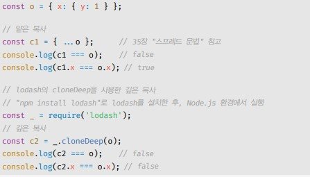

# 원시 값과 객체의 비교
- 원시 타입의 값, 즉 원시 값은 변경 불가능한 값이다.
- 객체 타입의 값, 즉 객체는 변경 가능한 값이다.
- 원시 값을 변수에 할당하면 변수(확보된 메모리 공간)에는 실제 값이 저장된다.
- 이에 비해 객체를 변수에 할당하면 변수에는 참조 값이 저장된다.
- 원시 값을 갖는 변수를 다른 변수에 할당하면 원본의 원시 값이 복사되어 전달된다. 이를 값에 의한 전답이라한다.
- 객체를 가리키는 변수를 다른 변수에 할당하면 원본의 참조 값이 복사되어 전달된다. 이를 참조에 의한 절달이라한다.

## 원시 값
- 원시 값은 변경 불가능한 값인데 값을 변경하지 못한다는건 변수를 재할당하지 못한다는 것을 의미하는게 아니다.
- 변수와 값은 구분해서 생각해야한다. 변수는 메모리 주소를 가르키는 식별자를 의미하고 값은 그 메모리 주소에 할당된 값을 의미한다.
- 즉 값을 변경하지 못한다는건 메모리에 저장되있는 값이 변경되지 않는다는 것이지 변수 값를 변경하지 못하는것은 아니다.
- 변수의 상대 개념인 상수는 재할당이 금지된 변수를 말한다. 상수는 단 한번만 할당이 허용되므로 변수 값을 변경할 수 없는것을 의미하기 때문에 변경 불가능한 값과 상수를 동일한 의미는 아니다.

```javascript
// const로 선언하더라도 값이 원시값이 아니면 변경될 수 있다.
const a = {}

a.name = 'test'
console.log(a)

// const에 의미는 재할당이 불가능한 변수일 뿐이다.
// a = {} 오류 반환
```


- 원시 값은 위 처럼 값이 변경되는 것이 아닌 변수의 메모리 주소가 변경되는 것이다.


- 원시 값이 변경 가능한 값인 경우 메모리 주소가 변경되는 것이 아닌 진짜 값이 변경되는 것이다.

## 문자열과 불변성
- 숫자는 1도, 1000000도 메모리에 저장될 때 동일한 8바이트가 필요하지만 문자열의 경우 몇글자인지에 따라 필요한 바이트의 크기가 달라진다.
- 그래서 C언어에서는 문자열을 문자의 배열로 처리하고, 자바는 문자열을 String 객체로 처리하지만 자바스크립트는 원시 타입으로 처리하고 있다.
- 자바스크립트는 문자열을 원시타입으로 제공한다. 그 말은 문자열은 불변성을 가진다는 의미인데 그렇기 떄문에 문자열은 재할당을 하면 메모리주소의 크기가 변경되지 않고도, 새로운 메모리 주소의 크기만 정해주면 되기 때문에 원시타입으로 제공이 되는 것이다.
- 문자열은 불변성을 가지기 때문에 값의 변경이 불가능하다. 예를 들어  var str = 'string'이라는 문을 str[0] = 'T' 라고 코드를 작성해도 str[0]은 변경되지 않는다.
- 문자열을 인덱스로 접근하거나 메소드를 사용할 수 있는건 문자열은 유사배열 객체이기 떄문이지만 이내용은 뒤에 나온다고 한다.

## 값에 의한 전달
- 원시 타입을 갖는 값들은 값에 의한 전달을 하는데 변수에 변수를 할당 했을때 주소 값이 아닌 원시 값이 복사되어 전달되는 것을 말합니다.
- 메모리 저장 방식은 ECMAScript 사양에 명확히 나와있지 않지만, 2가지 방식으로 저장된다고 한다.


- 첫 번째 방식은 저장될 값을 가지는 변수에 값을 복사에 새로운 변수에 할당하는 방식


- 두 번째 방식은 처음 할당할 때는 같은 메모리 주소를 가르키다가 어느 한쪽의 변수에 재할당이 이루어졌을때 새로운 메모리 공간에 재할당된 값을 저장하도록 동작하는 방식, 원시 값의 MDN은 위 방식을 사용한다고 적혀있지만, 어떤 방식을 차용하는지는 정확히 알 수 없다.

- 값에 의한 전달은 타언어의 용어일 뿐이고 사실 공유에 의한 전달이라고 표현하는 경우도 있다.

- 결국은 두 변수의 원시 값은 서로 다른 메모리 공간에 저장된 별개의 값이 되어 어느 한쪽에서 재할당을 통해 값을 변경하더라도 서로 간섭할 수 없다.

## 객체
- 객체는 프로퍼티의 개수가 정해져 있지 않으며, 동적으로 추가되고 삭제할 수 있기 때문에 객체는 원시 값과 같이 확보해야 할 메모리 공간의 크기를 사전에 정해 둘 수 없다.


- 자바스크립트의 객체 저장 방식은 키를 인덱스로 사용하는 해시 테이블이과 유사하게 저장된다고 한다. 이 방식 또한 브라우저 제조사마다 다를 수 있기때문에 정확한 방식은 알 수 없다고한다.


## 변경 가능한 값
- 원시 값은 변수에 값을 할당하면 값을 가지고있는 메모리 주소를 변수가 가르키지만
- 변경 가능한값 즉, 객체 타입의 값은 변수에 값을 할당해도 해당 값이있는 메모리 주소를 가르키는게 아닌 값을 다른 메모리 주소에 저장해놓고 그 주소를 할당될 변수 메모리 주소에 저장된다.


- 위 처럼 값을 가지고 있는 메모리 주소를 가르키는게 아닌 그 메모리 주소를 가르키는 메모리 주소를 가르킨다.
- 이를 참조 값이라고 한다.

- 객체를 생성하고 관리하는 방식은 매우 복잡하며 비용이 많이 들기 때문에 원시값처럼 값이 변경될때마다 그 값들을 새로 생성하고 저장하기에는 비효율적이기 때문에 불변성을 가지지 않는 것이다.
- 하지만 이러한 구조는 객체를 복사할 경우 발생한다. 값을 복사 할경우 변수는 객체의 값이 아닌 주소를 참조하고 있기 때문에 주소를 공유해 여러개의 식별자가 하나의 객체 주소를 공유하게 되는 것이다.
- 그래서 자바스크립트는 얕은 복사와 깊은 복사가 있다.
- 객체를 프로퍼티 값으로 갖는 객체의 경우 얕은 복사는 한 단계까지만 복사하는 것을 말하고 깊은 복사는 객체에 중첩되어 있는 객체까지 모두 복사하는 것을 말한다.



- 얕은 복사의 경우 참조 값을 공유하게 되고 깊은 복사의 경우 원시 값처럼 완전한 복사본을 만든다는 차이가 있다.

## 참조에 의한 전달
- 객체를 가리키는 원본 변수를 다른 변수에 할당하면 원본의 참조 값이 복사되어 전달된다. 이를 참조에 의한 절달이라 한다.


- 위 그림처럼 변수를 다른 변수에 할당하면 값이 아님 참조 값을 할당하는 것을 확인 할 수 있다.

```javascript
var person = {
  name : 'Lee'
};
var copy = person

copy.name = 'kim'
person.address = 'seoul'

console.log(person === copy)  // true
console.log(person) // { name: 'kim', address: 'seoul' }
console.log(copy) // { name: 'kim', address: 'seoul' }
```  

- 위와 같이 한쪽 객체의 값을 변경하면 참조 값이 같기 때문에 다른 변수에도 영향을 끼친다.