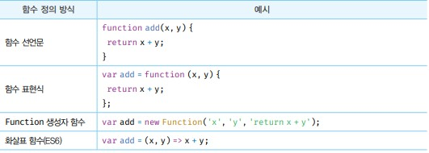

# 함수
- 프로그래밍 언어의 함수는 인련의 과정을 문으로 구현하고 코드 블록으로 감싸서 하나의 실행 단위로 정의한 것이다.
- 매개변수 : 함수 내부로 입력을 전달받는 변수
- 입력 : 인수
- 출력 : 반환값


- 함수는 함수 정의를 통해 생성한다. 자바스크립트는 다양한 방법으로 정의 할 수있다.


```javascript
// 함수 정의
function add(x, y){
  return x + y
}
```

- 함수 정의만으로 함수가 실행되는 것은 아니다. 인수를 매개변수를 통해 함수에 전달하면서 함수의 실행을 명시적으로 지시해야한다 이를 함수 호출이라 한다.

```javascript
// 함수 호출
var result = add(2, 5)
console.log(result)
console.log(add(2, 5))
```

## 함수를 사용하는 이유
- 함수는 필요할 때 여러 번 호출할 수 있다. 즉, 실행 시점을 개발자가 결정할 수 있고 몇 번이든 재사용이 가능하다.
- 함수는 몇 번이든 호출할 수 있으므로 코드의 재사용이라는 측면에서 매우 유용하다.

## 함수 리터럴

- 함수 리터럴의 구성요소는 다음과 같다.


## 함수 정의
- 함수 정의란 함수를 호출하기 이전에 인수를 전달받을 매개변수와 실행할 문들, 그리고 반환할 값을 지정하는 것을 말하며 함수를 정의하는 방법에는 4가지가 있다.

- Tip : 변수 선언과 함수 정의
  - 변수는 선언한다고 했지만 함수는 정의한다고 표현했다. 함수 선언문이 평가되면 암묵적으로 생성되고 함수 객체가 할당된다


- 함수 정의 방식에는 4가지가 있다.



## 함수 선언문

```javascript
// 함수 선언문
function add(x, y){
  return x + y;
}

// console.dir은 함수 객체의 프로퍼티까지 출력한다.
// 단, Node.js 환경에서는 console.log와 같은 결과가 출력된다.
console.dir(add) // f add(x,y)

// 함수 호출
console.log(add(2, 5)) // 7
```

- 함수 선언문은 함수 리터럴과 형태가 동일하다. 단, 함수 리터럴은 함수 이름을 생략할 수 있으나 함수 선언문은 함수 이름을 생략할 수 없다.

- 함수 선언문은 표현식이 아닌 문이다.  
- 하지만 전에 배웠던 내용에서 표현식이 아닌 문은 특정 변수에 값으로 할당되지 못한다고 했는데 함수 선언문은 특정 변수에 값으로 할당 될 수있다.
- 이 이유는 자바스크립트 엔진이 코드의 문맥에 따라 해석을 달리하기 때문이다.
- 코드블록의 `{}`와 객체 `{}`리터럴이 같지만 코드의 문맥에 따라 다르게 해석되는걸 생각하면 된다.

```javascript
// 함수 선언문
function foo() { console.log('foo'); };
foo() // foo

// 함수 리터럴
(function bar() { console.log('bar'); });
bar() // ReferenceError
```
- 위 코드의 단독으로 사용된 함수 리터럴은 함수 선언문으로 해석된다. 
- 하지만 그룹 연산자 `()` 내에 있는 함수 리터럴은 함수 선언문으로 해석되지 않고 값으로 평가되어 함수 리터럴 표현식으로 해석된다.
- 그룹 연산자의 피연산자는 값으로 평가될 수 있는 표현식이어야 한다. 따라서 표현식이 아닌 문인 함수 선언문은 피연산자로 사용할 수 없기 때문에 리터럴로 해석되는 것이다.
- 함수 이름은 함수 몸체 내에서만 참조할 수 있는 식별자다. 함수 이름이 메모리 주소를 가르킨다고 오해하면 안된다.


- bar 함수는 `()` 그룹연산자의 피연산자로 판별되 값으로 평가되었으며, 위 그림처럼 함수를 가리키는 식별자가 없기 때문에 bar 함수는 호출할 수 없다.


- 그럼 foo함수는 어떻게 어떻게 호출될 수 있을까 foo 또한 함수 몸체 내부에서만 유효한 식별자인 함수이름만 있기 때문에 호출 할수 없어야 한다. 하지만 foo는 자바스크립트 엔진이 암묵적으로 생성한 식별자가 되었다. 자바스크립트 엔진은 함수 선언문으로 해석되면 생성된 함수를 호출하기 위해 함수 이름과 동일한 이름의 식별자를 암묵적으로 생성하고, 거기에 함수 객체를 할당하게 되어 foo를 호출 할수 있는 것이다.


- 결국 위 그림과 같이 함수 선언문 으로 판별되면 var add를 선언하지 않아도 암묵적으로 생성되는 것이다.
- 함수는 함수이름으로 호출하는 것이 아니라 함수 객체를 가리키는 식별자로 호출한다.

## 함수 표현식
- 함수는 객체 타입의 값으므로 함수는 값처럼 변수에 할당 할 수도있고 프로퍼티 값이 될 수도 있으며, 배열의 요소가 될 수도 있다 이처럼 값의 성질을 갖는 객체를 일급 객체라고한다.

```javascript
// 함수 표현식
var add = function (x, y){
  return x + y;
};

console.log(add(2, 5)) // 7
```

- 위 코드는 함수 표현식이다. 함수 선언문에 식별자가 없으면 함수 표현식이 되는것이다. 그렇다고 함수 선언문과 함수 표현식이 정확히 동일하게 동작하는 것은 아니다.
- 함수 리터럴의 함수 이름은 생략할 수 있는데 이러한 함수를 익명함수라 한다. 함수 표현식의 함수 리터럴은 함수 이름을 생략하는 것이 일반적이다.
- 함수 이름은 함수 몸체 내부에서만 유요한 식별자이므로 함수 이름은 함수를 호출할 수 없다
- 함수 선언문의 함수 이름으로 식별자를 암묵적 생성하고 생성된 함수 객체를 할당하므로 함수 표현식과 유사하게 동작하는 것처럼 보이지만 함수 선언문은 "표현식이 아닌 문"이고 함수 표현식은 "표현식인 문"이다. 미묘하지만 중요한 차이가 있다.

- 정리 
  - 값(피 연산자)이 되면 함수 리터럴(함수 이름 생략 가능)
  - 표현식이 아닌 문이면 함수 선언문(함수 이름만 선언되있을 시)
  - 표현식인 문이되면 함수 표현식(리터럴이 변수에 할당되면)

## 함수 생성 시점과 함수 호이스팅
- 함수 선언문으로 정의한 함수는 함수 선언문 이전에 호출할 수 있다.
- 함수 선언문의 경우 런타임 이전에 함수 객체가 먼저 생성된다. 그리고 함수이름과 동일한 이름의 식별자를 암묵적으로 생성하고 생성된 함수 객체를 할당한다.
- 즉, 함수 선언문은 함수 호이스팅이 발생한다.
- 함수 호이스팅과 변수 호이스팅은 차이가 있다.
- 둘다 런타임 이전에 실행되어 식별자를 생성한다는 점에서 동일하지만, var 키워드는 undefined로 초기화 되고 함수는 함수 객체로 초기화되는데 변수의 할당은 해당 변수가 런타임의 실행는 시점이라 undefined를 반환하고 함수는 호출되는 시점에 함수 객체가 할당되기 때문에 같은 var로 인한 변수 호이스팅이지만 다른 값을 반환하는 것이다.
- 함수 표현식은 변수에 함수 리터럴이 들어가 있는 방식이기 때문에 함수 표현식은 함수 호이스팅이 아닌 변수 호이스팅이 발생한다.

## 참조에 의한 전달과 외부 상태의 변경
- 함수의 매개변수도 함수 몸체 내부에서 변수와 동일하게 취급되므로 매개변수 또한 타입에 따라 값에 의한 전달, 참조에 의한 전달 방식을 그대로 따른다.
- 그렇기 때문에 함수의 매개변수로 원시값, 객체값을 변경하면 원시 값을 가진 매개변수는 변하지 않지만 객체타입의 값은 함수 내부에서 변경해도 외부에 내용이 변경된다.

```javascript
function test(primitive, obj){
  primitive += 100
  obj.name = 'kim'
}

var num = 100
var person = {name : 'lee'}

test(num, person)

// 원시 값은 변경되지 않는다.
console.log(num)// 100

// 객체는 원본이 훼손된다.
console.log(person) // {name: kim}
```

## 즉시 실행 함수
- 함수 정의와 동시에 즉시 호출되는 함수를 죽시 실행함수라고한다.

```javascript
// 익명 즉시 실행 함수
(function (){
  var a = 3;
  var b = 5;
  return a * b
}())
```
- `( )` 연산자로 함수를 묶은 이유는 함수 리털럴로 평가되기 위해서이다.

```javascript
// 즉시 실행함수도 값을 반환할 수 있다.
var res = (function () {
  var a = 3
  var b = 3
  return a * b
}())

console.log(res) // 15
```
- 마지막 매개변수 값을 설정하고 함수 마지막 `()`에 인수를 넣고 실행할 수도 있다.

## 콜백 함수
- 함수의 매개변수를 통해 다른 함수의 내부로 전달되는 함수를 콜백함수라고한다. 
- 매개변수를 통해 함수의 외부에서 콜백 함수를 전달받은 함수를 고차 함수라고한다.
- 고차 함수는 매개변수를 통해 전달받은 콜백 함수의 호출 시점을 결정해서 호출한다. 즉, 콜백함수는 고차 함수에 의해 호출되며 이때 고차 함수는 필요에 따라 콜백 함수에 인수를 전달할 수 있다.

## 순수 함수와 비순수 함수
- 외부 상태에 의존하지도 않고 변경하지도 않는 즉, 부수 효과가 없는 함수를 순수 함수라고 한다.
- 외부 상태에 의존하거나 외부 상태를 변경하는 즉, 부수 효과가 있는 함수를 비순수 함수라고 한다.
- 순수 함수는 동일한 인수가 전달되면 언제나 동일한 값을 반환하는 함수다. 순수함수는 어떤 외부상태에도 의존하지 않고 오직 매개변수를 통해 함수 내부로 전달된 인수에게만 의존해 반환값을 만들며 함수의 외부 상태를 변경하지 않는다.

```javascript
// 순수함수
var count = 0

function plus(n){
  n = n+1
  console.log(n) //1
  return n // 1
}
plus(count)
console.log(count) // 0
```

- 비순수 함수는 아래 코드 처럼 함수의 결과가 함수 외부의 영향을 주는것을 말한다.

```javascript
// 비순수 함수
let count = 0

function plus(){
  return ++count
}
plus()
console.log(count) //1
```
