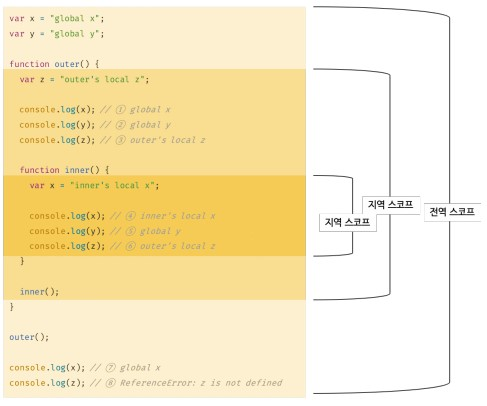
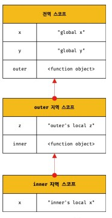

# 스코프
- 스코프는 키워드별 var, let, const 키워드로 선언한 변수의 동작이 달리지고, 변수, 함수에 따라서도 달라진다.
- 모든 식별자는 자신이 선언된 위치에 의해 다른 코드가 식별자 자신을 참조할 수 있는 유효 범위가 결정된다. 즉, 스코프는 식별자가 유효한 범위를 말한다.
- 스코프는 식별자를 검색할 때 사용하는 규칙이라고도 할 수있다. 자바스크립트 엔진은 코드를 실행할 때 코드의 문맥을 고려하기 때문에 어디서 실행되며 주변에 어떤 코드가 있는지에 따라 다른 결과를 만들어 낸다.


## 스코프의 종류

|구분|설명|소코프|변수|
|--|--|--|--|
|전역|코드의 가장 바깥 영역|전역 스코프|전역 변수|
|지역|함수 몸체 내부|지역 스코프|지역 변수|

- 변수는 자신이 선언된 위치에 의해 자신이 유효한 범위인 스코프가 결정된다. 즉, 전역에서 선언된 변수는 전역 스코프를 갖는 전역 변수이고, 지역에서 선언된 변수는 지역 스코프를 갖는 지역 변수가 되는 것이다.



- 전역 변수는 어디서든지 참조할 수 있다.
- 지역 변수는 자신의 지역 소코프와 하위 지역 소코프에서 유효하다.
- 만약 하위 스코프에 전역 변수와 지역 변수의 동일한 이름이 존재한다면 자신이 호출할 위치에 가까운 변수를 참조하게 된다. 이는 자바스크립트 엔진이 스코프 체인을 통해 참조할 변수를 검색했기 때문이다.

## 스코프 체인
- 함수는 중첩될 수 있으므로 함수의 지역 스코프도 중첩될 수 있다. 이는 스코프가 함수의 중첩에 의해 게층적 구조를 갖는다는 것을 의미한다.



- 이처럼 모든 스코프는 하나의 계층적 구조로 연결되며, 모든 지역 스코프의 최상위 스코프는 전역 스코프다. 이렇게 스코프가 계층적으로 연결된 것을 스코프 체인이라 한다.
- 변수를 참조할 때 자바스크립트 엔진은 스코프 체인을 통해 변수를 참조하는 코드의 스코프에서 시작하여 상위 스코프 방향으로 이동하며 선언된 변수를 검삭핸다. 이를 통해 상위 스코프에서 선언한 변수를 하위 스코프에서도 참조할 수 있다.


## 함수 레벨 스코프
- var키워드로 선언된 변수는 오로지 함수의 코드 블록만을 지역 스코프만으로 인정해 for문이나 if문 같은 코드블록을 지역 스코프로 인정하지 않는다. 그렇기 때문에 아래 코드 같은 사례가 발생한다.

```javascript
var x = 1
if(true){
  var x = 10
}
console.log(x) // 10
```
- 이처럼 var키워드는 함수만 지역 스코프로 인정하기 때문에 var x 자체도 사실 전역 변수로 생성된 것이다.
- 의도치 않은 결과들로 인핸 ES6에서 let, const 키워드가 생겨나 함수 코드블록만 지역 스코프로 인정하지 않고 블록레벨 스코프도 지원하게 되었다.

## 렉시컬 스코프
- 함수의 상위 스코프를 결정하는 방법은 2가지로 나뉜다.
  - 동적 스코프 : 함수를 어디서 호출했는지에 따라 함수의 상위 스코프를 결정한다.
  - 렉시컬(정적) 스코프 함수를 어디서 정의했는지에 따라 함수의 상위 스코프를 결정한다.


- 동적 스코프는 함수를 정의하는 시점에서는 함수가 어디서 호출될지 알 수 없다. 따라서 함수가 호출되는 시점에 동적으로 상위 스코프를 결정해야 하기 때문에 동적 스코프라고 부른다.

- 렉시컬 스코프 또는 정적 스코프라는 상위 스코프가 동적으로 변하지 않고 함수 정의가 평가되는 시점에 상위 스코프가 정적으로 결정된다.

- 자바스크립트는 렉시컬 스코프를 따르기 때문에 함수의 상위 스코프는 함수 정의가 실행될 때 정적으로 결정된다.