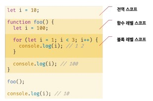

# let, const 키워드와 블록 레벨 스코프

## let 키워드
- let 키워드는 변수 중복 선언이 금지되어 있다. var키워드는 에러가 발생하지 않지만 let 키워드는 중복 선언을 한다면 문법 에러가 발생한다.

- var키워드는 함수의 코드반을 지역 스코프로 인정하지만, let 키워드는 모든 코드 블록을 지역 스코프로 인정하는 블록 레벨 스코프를 따른다.

- 변수 호이스팅 - let 키워드로 선언한 변수는 `선언 단계`와 `초기화 단계`가 분리되어 진행된다. var키워드 같은 경우 선언을 하게되면 암묵적으로 undefined로 초기화 되었지만 let은 그렇지 않고 초기화 단계는 변수 선언문에 도달했을 때 실행된다.
- 스코프의 시작 지점부터 초기화 시작 지점까지 변수를 참조할 수 없는 구간을 일시적 사각지대(TDZ)라고 부른다.

## const 키워드
- let과 대부분 동일하지만 다른 부분만 정리하겠습니다.

- 선언과 초기화 - const 키워드로 선언한 변수는 반드시 선언과 동시에 초기화해야 한다.
- let과 마찬가지로 블록 레벨 스코프를 가진다.
- 재할당 금지
- const는 대체로 상수를 표현할 때 사용한다. 하지만 꼭 그렇다고 할수 없다. 원시 값의 경우 변수의 값이 변경되면 새로운 메모리 주소를 할당 해야하기 때문에 재할당이 불가능해 값이 변하지 않는 상수로 생각할 수 있지만
- 객체타입의 경우 변수의 참조 값이 저장되므로 참조 값이 가르키는 원본 데이터는 변경이 가능하기 때문에 const는 재할당을 금지할 뿐 `불변`을 의미하지는 않는다.

## var VS let VS const
- 변수 선언에는 기본적으로 const를 사용하고 let은 재할당이 필요한 경우에 한정해 사용하는 것이 좋다.
- const 키워드를 사용하면 의도치 않은 재할당을 방지하기 때문에 좀더 안전하다.
- ES6를 사용한다면 var 키워드는 사용하지 않는걸 권장한다.
- 변수를 선언하는 시점에 재할당이 필요할지 잘 모르는 경우 우선 const로 선언하고 그 뒤 상황에 맞게 let으로 변경하는게 바람직 하다.

