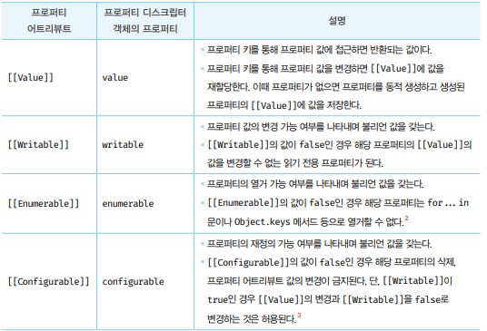
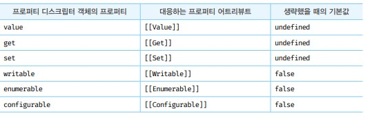
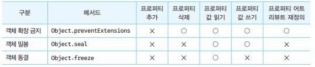

# 프로퍼티 어트리뷰트

## 내부 슬롯과 내부 메서드
- 내부슬로과 내부 메서드는 자바스크립트 엔진에서 동작하지만 개발자가 직접 접근할 수 있도록 외부로 공개된 객체의 프로퍼티는 아니다. 단, 일부 내부 슬롯과 내부 메서드에 한하여 간집적으로 접근할 수 있는 수단을 제공한다.

## 프로퍼티 어트리뷰트와 프로퍼티 디스크립터 객체
- 자바스크립트 엔진은 프로퍼티를 생성할 때 프로퍼티의 상태를 나타내는 프로퍼티 어트리뷰트를 기본값으로 자동 정의한다.
- 프로퍼티의 상태란 프로퍼티의 값, 값의 갱신 가능 여부, 열거 기능 여부, 재정의 가능 여부를 말한다.
- 프로퍼티 디스크립터 객체 : 객체의 정보를 담고있는 이름


## 데이터 프로퍼티와 접근자 프로퍼티
- 데이터 프로퍼티 : 키와 값으로 구성된 일반적인 프로피터
- 접근자 프로퍼티 : 자체적으로는 값을 갖지 않고 다른 데이터 프로퍼티의 값을 읽거나 저장할 때 호출되는 접근자 함수로 구성된 프로퍼티다.

- 데이터 프로퍼티는 다음과 같은 프로퍼티 어트리뷰트를 갖는다. 프로퍼티가 생성될 때 기본값으로 자동 정의된다.



- 접근자 프로퍼티는 다음과 같은 프로퍼티 어트리뷰트를 갖는다.

|프로퍼티 어트리뷰트|프로퍼티 디스크립터 객체의 프로퍼티|설명|
|--|--|--|
|[[Get]]|get|접근자 프로퍼티를 통해 데이터 프로퍼티의 값을 읽을 때 호출되는 접근자 함수다. 즉, 접근자 프로퍼티 키로 프로퍼티 값에 접근하면 프로퍼티 어트리뷰트 `[[Get]]`의 값, 즉 getter 함수가 호출되고 그 결과가 프로퍼티 값으로 반환된다.|
|[[Set]]|Set|접근자 프로퍼티를 통해 데이터 프로퍼티의 값을 읽을 때 호출되는 접근자 함수다. 즉, 접근자 프로퍼티 키로 프로퍼티 값에 접근하면 프로퍼티 어트리뷰트 `[[Set]]`의 값, 즉 setter 함수가 호출되고 그 결과가 프로퍼티 값으로 반환된다.|
|[[Enumerable]]|enumerable|데이터 프로퍼티의 `[[Enumerable]]`과 같다|
|[[Configurable]]|configurable|데이터 프로퍼티의 `[[Configurable]]`과 같다|

- 접근자 함수는 getter / setter 함수라고도 부른다.
- 동작방식은 접근자 함수의 파라미터 값을 getter함수로 읽은 후 setter함수를 호출합니다. setter함수가 값을 저장한 후 결과가 프로퍼티 값으로 반환됩니다.

- 접근자 프로퍼티와 데이터 프로퍼티를 구별하는 방법은 다음과 같습니다.
```javascript
// 일반 객체의 __proto__는 접근자 프로퍼티 입니다.
Object.getOwnProertyDescriptor(Object.prototype, '__proto__')

// 함수 객체의 prototype은 데이터 프로퍼티다.
Object.getOwnProertyDescriptor(function() {}, 'prototype')
```

## 프로퍼티 정의
- 프로퍼티 정의란 새로운 프로퍼티를 추가하면서 프로퍼티 어트리뷰트를 명시적으로 정의하거나, 기존 프로퍼티의 프로퍼티 어트리뷰트를 재정의 하는 것을 말합니다.
- Object.defineProperty 메서드를 사용하면 프로퍼티의 어트리뷰트를 정의할 수 있습니다.
```javascript
const person = {}

Object.defineProperty(person, 'firstName', {
  value: 'song',
  writable: true,
  enumerable: true,
  configurable: true
});

Object.defineProperty(person, 'lastName', {
  value : 'lee'
});
```

- 프로퍼티를 정의할 때 프로퍼티 디스크립터 객체의 프로퍼티를 일부 생략할 수 있다. 생략할 경우 기본값이 적용됩니다.



- Object.definePropety 메서드는 한번에 하나의 프로퍼티만 정의할 수 있다. Object.defineProperties 메서드를 사용하면 여러 개의 프로퍼티를 한 번에 정의할 수 있다.

```javascript
const person = {}

Object.defineProperties(person,{
  firstName: {
    value: 'song',
    writable: true,
    enumerable: true,
    configurable: true
  },
  lastName: {
    value: 'lee',
    writable: true,
    enumerable: true,
    configurable: true
  },
  fullName: {
    get(){
      return `${this.firstName} ${this.lastName}`
    },
    set(name){
      [this.fistName, this.lastName] = name.split(' ');
    },
    enumerable: true,
    configurable: true
  }
});

person.fullName = 'song yu';
console.log(person)
```

## 객체 변경 방지
- 객체는 변경 가능한 값이므로 재할당 없이 직접 변경할 수 있다. 즉, 프로퍼티를 추가하거나 삭제할 수 있고, 프로퍼티 값을 갱신할 수 있으며, 재정의할 수도 있다.
- 자바스크립트는 객체의 변경을 방지하는 다양한 메서드를 제공한다. 객체 변경 방지 메서드들은 객체의 변경을 금지하는 강도가 다르다.



- 객체 확장 금지 : 프로퍼티 추가 금지를 의미한다 `Object.preventExtensions` 확장민 금지이고 삭제는 가능하다.
- 객체 밀봉 : 프로퍼티 추가 및 삭제와 재정의 금지를 의미한다. `Object.seal` 즉 밀봉된 객체는 읽기와 쓰기만 가능하다. 하지만 프로퍼티 값 갱신(재 정의)은 가능하다.
- 객체 동결 : 프로퍼티 추가 및 삭제와 재정의 금지, 값 갱신 금지를 의미한다. 읽기만 가능하다 Obejct.freeze(person)

## 불변 객체
- 위에 나타난 변경 방지 메서드들은 얕은 변경 방지로 직속 프로퍼티만 변경이 방지되고 중첩 객체 까지는 영향을 주지 못한다.
- 그렇기 때문에 모든 프로퍼티에 대해 재귀적으로 Object.feeze 메서드를 호출해야 한다.

