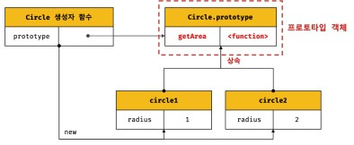

# 프로토타입
## 상속과 프로토타입
- 생성자 함수는 동일한 프로퍼티 구조를 갖는 객체를 여러 개 생성할 때 유용하다. 하지만 생성자 함수의 메서드는 대부분의 경우 인스턴스를 생성할 때마다 메서드를 중복 생성하고 모든 인스턴스가 중복 소유한다. 이럴 경우 메모리가 불필요하게 낭비되는데 상속을 통해 불필요한 중복을 제거할 수있다.

```javascript
function Circle(radius){
  this.radius = radius
}

// Circle 생성자 함수가 생성한 모든 인스턴스가 getArea 메서드를 
// 공유해서 사용할 수 있도록 프로토타입에 추가한다.
// 프로토타입은 Circle 생성자 함수의 prototype 프로퍼티에 바인딩되어 있다.
Circle.prototype.getArea = function(){
  return Math.PI * this.radius ** 2
}

const circle1 = new Circle(1)
const circle2 = new Circle(2)

// Circle 생성자 함수가 모든 인스턴스는 부모 객체의 역할을 하는
// 프로토타입 Circle.prototype으로부터 getArea 메서드를 상속받는다
// 즉, Circle 생성자 함수가 생성하는 모든 인스턴스는 하나의 getArea 메서드를 공유한다.

console.log(circle1.getArea === circle.getArea) // true
```
- 결국 getArea 메서드는 단 하나만 생성되어 프로토타입인 Circle.prototype의 메서드로 할당되어 상속받을 수 있는 것이다.

## 프로토타입 객체
- 프로토타입을 상속받은 하위 객체는 상위 객체의 프로퍼티를 자신의 프로퍼티처럼 자유롭게 사용할 수 있다.
- 모든 객체는 [[prototype]] 이라는 내부 슬롯을 가진다.
- 객체가 생성될 때 객체 생성 방식에 따라 프로토타입이 결정되고 [[prototype]]에 저장된다.
- 에를 들어, 객체 리터럴에 의해 생성된 객체의 프로토타입은 Object.prototype이고 생성자 함수에 의해 생성된 객체의 프로토타입은 생성자 함수의 prototype 프로퍼티에 바인딩 되어 있는 객체다.


## __proto__ 접근자 프로퍼티
- 모든 객체는 `__proto__` 접근자 프로퍼티를 통해 자신의 프로토타입 내부 슬롯에 간접적으로 접근할 수 있다.
- `__proto__` 접근자 프로퍼티를 통해 간접적으로 [[Prototype]] 내부 슬롯의 값, 즉 프로토타입에 접근할 수 있다.
- 접근자 프로퍼티는 자체적으로 값을 갖기 않고 접근자 함수 [[Get]], [[Set]] 프로퍼티 어트리뷰트로 구성된 프로퍼티다.
- prototype 내부 슬롯에 간접적으로 접근할 수 있는 방법은  `__proto__` 접근자 프로퍼티를 통해 자체적인 value는 
갖고 있지 않기 때문에 접근자 함수인 getter setter로 접근할 수 있다. 그렇기 때문에 __proto__접근자 프로퍼티를 통해
접근하면 getter 함수가 호출되고 새로운 프로토타입을 할당하면 setter함수가 호출되는 것이다.
- 다시한번 말하지만 `__proto__` 접근자 프로퍼티는 객체가 직접 소유하는 프로퍼티가 아니라 Object.prototype의 프로퍼티이기 때문에 상속에 의해 Object.prototype.`__proto__` 접근자 프로퍼티를 사용할 수 있다.
- 열심히 공부를 하고나니 `__proto__` 접근자 프로퍼티를 직접 사용하는 것은 권장하지 않는다고 한다.
- 모든 객체가 `__proto__` 접근자 프로퍼티를 사용할수 있는 것은 아니기 때문이다.
- `__proto__` 접근자 프로퍼티 대신 프로토타입의 참조를 취득하고 싶은 경우에는 Obejct.getPropertyOf 메서드를 사용하고, 프로토타입을 교체하고 싶은 경우에는 Object.setPrototypeOf 메서드를 사용할 것을 권장한다고 한다.

## 함수 객체의 prototype 프로퍼티
- 함수 객체만이 소유하는 prototype 프로퍼티는 생성자 함수가 생성할 인스턴스의 프로토타입을 가리킨다.
- prototype 프로퍼티는 생성자가 함수가 생성할 객체의 프로토타입을 가리킨다. 따라서 생성자 함수로서 호출할 수 없는 함수, 즉 non-constructor인 화살표 함수와 ES6 메서드 축약 표현으로 정의한 메서드는 prototype 프로퍼티를 소유하지 않으며 프로토타입도 생성하지 않는다.




- 모든 객체가 가지고 있는 `__proto__` 접근자 프로퍼티와 함수 객체만이 가지고 있는 prototype 프로퍼티는 결국 동일한 프로토타입을 가르킨다.


## 리터럴 표기법에 의해 생성된 객체의 생성자 함수와 프로토타입
- 리터럴 표기법에 의해 생성된 객체도 물론 프로토타입이 존재하지만 리터럴 표기법에 의해 생성된 객체의 경우 프로토타입의 constructor 프로퍼티가 가리키는 생성자 함수가 반드시 객체를 생성한 생성자 함수라고 단정할 수는 없다.
- 하지만 Obejct 생성자 함수에 인수를 전달하지 않거나 undefined 또는 null을 인수로 전달하면서 호출하면 내부적으로는 추상 연산을 호출하여 Object.prototype을 프로토타입으로 갖는 빈 객체를 생성한다.
- 리터럴 표기법에 의해 생성된 객체도 상속을 위해 프로토타입이 필요하다. 따라서 리터럴 표기법에 의해 생성된 객체도 가상적인 생성자 함수를 갖는다. 
- 리터럴 표기법에 의해 생성된 객체는 생성자 함수에 의해 생성된 객체는 아니지만 큰틀에서 생각하면 본질적인 면에서 큰차이는 없다
- 프로토타입의 constructor 프로퍼티를 통해 연결되어 있는 생성자 함수를 리터럴 표기법으로 생성한 객체를 생성한 생성자 함수로 생각해도 크게 무리는 없다.


## 프로토타입의 생성 시점
- 프로토타입은 생성자 함수가 생성되는 시점에 더불어 생성된다.
- 프로토타입과 생성자 함수는 단독으로 존재할 수 없고 언제나 쌍으로 존재하기 때문이다.
- 생성자 함수는 사용자가 직접 정의한 사용자 정의 생성자 함수와 자바스크립트가 기본 제공하는 빌트인 생성자 함수로 구분할 수 있다.
- 사용자 정의 생성자 함수의 프로토타입 생성 시접은 자신이 평가되어 함수 객체로 생성되는 시점에 프로토타입도 더불어 생성되며, 생성된 프로토타입의 프로토타입은 언제나 Object.prototype이다.

- 빌트인 생성자 함수와 프로토타입 생성 시점은 전역 객체가 생성되는 시점에 생성된다.

## 객체 생성 방식과 프로토타입의 결정
- 추상연산은 필수적으로 자신이 생성할 객체의 프로토타입을 인수로 전달 받는다. 
- 프로토타입은 추상 연산에 전달되는 인수에 의해 결정된다. 이 인수는 객체가 생성되는 시점에 객체 생성 방식에 의해 결정된다.
- 객체 리터럴에 의해 생성된 객체의 프로토타입은 constructor 프로퍼티와 hasOwnProperty 메서드 등을 소휴하지 않지만 자신의 프로토타입인 Object.prototype의 메서드를 상속받아 자유롭게 사용할 수 있는 것이다.
- Object 생성자 함수에 의해 생성괸 객체의 프로토타입은 객체리터럴과 마찬가지로 추상연산 OrdinaryObjectCreate가 호출된다. 이때 추상 연산에 전달되는 프로토타입은 Object.prototype이다 즉, Object 생성자 함수에 의해 생성되는 객체의 프로토타입은 Object.prototype이다.
- 둘의 차이는 프로퍼티를 추가하는 방식에 있다. 객체 리터럴 방식은 객체 리터럴 내부에 프로퍼티를 추가하지만 Object 생성자 함수 방식은 일단 빈 객체를 생성한 이후 프로퍼티를 추가해야한다.
- 생성자 함수에 의해 생성된 객체의 프로토타입도 다른 객체 생성 방식과 마찬가지로 추상연산 OrdinaryObjectCreate가 호출된다. 이때 추상연산에 전달되는 프로토타입은 생성자 함수의 prototype 프로퍼티에 바인딩되어 있는 객체다. 즉, 생성자 함수에 의해 생성되는 객체의 프로토타입은 생성자 함수의 prototype 프로퍼티에 바인딩되 있는 객체다. 사용자 정의 생성자 함수와 더불어 생성된 프로토타입의 프로퍼티는 constructor뿐이다.
- 그렇기 때문에 일반 객체와 같이 프로토타입에 프로퍼티를 추가/삭제를 해 자신의 메서드처럼 사용할 수 있다.

## 프로토타입 체인
- 포로토타입의 포로토타입은 언제나 Object.prototype이다.
- 자바스크립트는 객체의 프로퍼티에 접근하려고 할 때 해당 객체에 접근하려는 프로퍼티가 없다면 [[Prototype]] 내부 슬롯의 참조를 따라 자신의 부모 역할을 하는 프로토타입의 프로퍼티를 순차적으로 검색한다. 이를 프로토타입 체인이라 한다.

## 오버라이딩과 프로퍼티 섀도잉
?? 이해가 안되니 내일하자


## 프로토타입의 교체
- 프로토타입은 임의의 다른 객체로 변경할 수 있다. 이것은 부모 객체인 프로토타입을 동적으로 변경할 수 있다는 것을 의미한다. 이러한 특징을 활용하여 객체 간의 상속 관계를 동적으로 변경할 수 있다. 포로토타입은 생성자 함수 또는 인스턴스에 의해 고체할 수 있다.
- 프로토타입 교체를 통해 객체 상속 관계를 동적으로 변경하는것은 꽤나 번거롭기 때문에 직접 교체하지 않는 것이 좋다. 상속관게를 인위적으로 설정하려면 직접 상속이 더 편리하고 안전하다.


## instanceof 연산자
- instanceof 연산자는 이항 연산자로서 좌변에 객체를 가리키는 식별자, 우변에 생성자 함수를 가르키는 식별자를 피연자로 받는다. 반약 우변의 피연산자가 함수가 아닌 경우 TypeError가 발생한다.
- 우변의 생성자 함수의 prototype에 바인딩된 객체가 좌변의 객체의 프로토타입 체인 상에 존재하면 true로 평가되고, 그렇지 않은 경우에는 false로 평가된다.
```javascript
function Person(name){
  this.name = name
}

const me = new Person('Lee');

console.log(me instanceof Person) //true

console.log(me instanceof Object) // true
```
- 즉 생성자 함수의 prototype에 바인딩된 객체가 프로토타입 체인 상에 존재하는지 확인한다.

## 직접 상속
- Object.create 메서드는 명시적으로 프로토타입을 지정하여 새로운 객체를 생성한다.
- 이것도 내일

## 정적 프로퍼티 / 메서드
- 정적 프로퍼티 / 메서드는 생성자 함수로 인스턴스를 생성하지 않아도 참조 / 호출할 수 있는 프로퍼티 / 메서드를 말한다.
```javascript
// 생성자 함수
function Person(name) {
  this.name = name
}

// 프로토타입 메서드
Person.prototype.sayHello = function() {
  console.log(`hi! My name is ${this.name}`)
}

// 정적 프로퍼티 
Person.staticProp = 'static prop'

// 정적 메서드
Person.staticMethod = function () {
  console.log('staticMethod')
}

// 생성자 함수에 추가한 정적 프로퍼티 / 메서드는 생성자 함수로 참조 / 호출한다.
Person.staticMethod() // staticMethod

// 정적 프로퍼티 / 메서드는 생성자 함수가 생성한 인스턴스로 참조 / 호출할 수 없다.
// 인스턴스로 참조 / 호출할 수 있는 프로퍼티/메서드는 프로토타입 체인 상에 존재해야 한다.
me.staticMethod() // TypeError : me.staticMethod is not a function
```

- person 생성자 함수는 객체이므로 자신의 프로퍼티 / 메서드를 소유할 수 있다. Person 생성자 함수 객체가 소유한 프로퍼티 / 메서드를 정적 프로퍼티 / 메서드라고 한다. 정적 프로퍼티 / 메서드는 생성자 함수가 생성한 인스턴스로 참조 / 호출할 수 없다.

- 내일하자


## 프로퍼티 존재 확인
- in 연산자 : 객체 내에 특정 프로퍼티가 존재하는지 여부를 확인한다. 
  - 'name' in person
- ES6에서 도입된 Reflect.has 메서드를 사용할 수도 있다. in 연산자와 동일하게 동작한다.
  - Reflect.has(person, 'name')
- Object.prototype.hasOwnProperty 메서드를 사용해도 객체에 특정 프로퍼티가 존재하는지 확인할 수 있다.
  - person.hasOwnProperty('name')
  - 인수로 전달받은 프로퍼티 키가 객체 고유의 프로퍼티 키인 경우에만 true를 반환하고 상속받은 프로토타입의 프로퍼티 키인 경우 false를 반환한다.
## 프로퍼티 열거
- 객체의 모든 프로퍼티를 순회하며 열거하려면 for...in문을 사용한다.

```javascript
const person = {
  name : 'Lee',
  address: 'Seoul'
}
// 객체가 상속받은 모든 프로토타입의 프로퍼티를 확인
console.log('toString' in person) // true

// 상속받은 프로퍼티는 열거되지 않는다.
for(const key in person){
  console.log(key + ':' +person[key])
  // name : Lee
  // address : Seoul
}
```
- 해당 객체의 어트리뷰트 [[Enumerable]]의 값이 true인 것만 for in 문의 열거가 되는 것이다.
- 배열에서는 for ... in 문을 사용하지 않는걸 권장한다. 배열도 객체이므로 프로퍼티와 상속받은 프로퍼티가 포함될 수 있다.

## Object.keys/values/entries 메서드
- 객체 자신의 고유 프로퍼티만 열거하기 위해서는 for ...in 문을 사용하는 것보다 Object.keys/values/entries 메서드를 사용하는 것을 권장한다.
- Object.keys 메서드는 객체 자신의 열거 가능한 프로퍼티 키를 배열로 반환한다.

```javascript
const person = {
  name : 'lee',
  address: 'Seoul',
  __proto__: {age : 20}
}
console.log(Object.keys(person)) // ["name", "address"]
console.log(Object.values(person)) // ["lee", "Seoul"]
console.log(Object.values(entries)) // [["name","ee"], ["address", "Seoul"]]

```