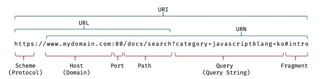
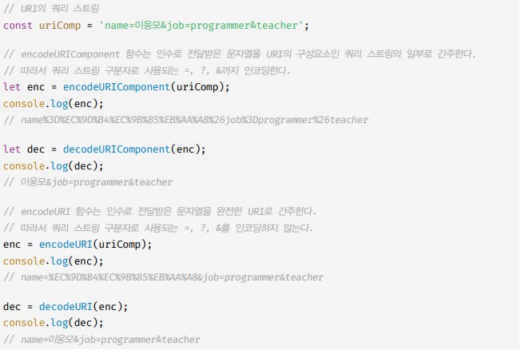

# 빌트인 객체

## 자바스크립트 객체의 분류

- 표쥰 빌트인 객체
    - 표준 빌트인 객체는 ECMAScript 사양에 정의된 객체를 말하며, 애플리케이션 전역의 공통 기능을 제공한다. 표준 빌트인 객체는 전역 객체의 프로퍼티로서 제공된다. 따라서 별도의 선언 없이 전역 변수처럼 언제나 참조할 수 있다.
- 호스트 객체
    - 호스트 객체는 ECMAScript 사양에 정의되어 있지 않지만 자바스크립트 실행 환경에서 추가로 제공하는 객체를 말한다.
    - 예를들어 브라우저 환경에서는 DOM, BOM, Canvas등과 같은 클라이언트 사이드 Web API를 호스트 객체로 제공하고, Node.js 환경에서는 Node.js 고유의 API를 호스트 객체로 제공한다.
- 사용자 정의 객체
    - 사용자 정의 객체는 표준 빌트인 객체와 호스트 객체처럼 기본 제공되는 객체가 아닌 사용자가 직접 정의한 객체를 말한다.

## 표준 빌트인 객체
- 자바스크립트는 Object, String, Number, Symbol, Date, Math 등 40여 개의 표준 빌트인 객체를 제공한다.
- Math, Reflect, JSON을 제외한 표준 빌트인 객체는 모두 인스턴스를 생성할 수 있는 생성자 함수 객체다.
- 생성자 함수 객체인 표준 빌트인 객체는 프로토타입 메서드와 정적 메서드를 제공하고, 생성자 함수 객체가 아닌 표준 빌트인 객체는 정적 메서드만 제공한다.
- 생성자 함수인 표준 빌트인 객체가 생성한 인스턴스의 프로토 타입은 표준 빌트인 객체의 prototype 프로퍼티에 바인딩된 객체다.
- 

## 원시값과 래퍼 객체
- 원시값을 객체처럼 사용하면 자바스크립트 엔진은 암묵적으로 연관된 객체를 생성하여 생성된 객체로 프로퍼티에 접근하거나 메서드를 호출하고 다시 원시값으로 되돌린다.
- 이처럼 문자열, 숫자, 불리언 값에 대해 객체처럼 접근하면 생성되는 임시 객체를 래퍼 객체라고한다.

```javascript
const str = "hi"

console.log(str.length) // 2
console.log(str.toUpperCase()) // HI
console.log(str) // hi
```
- 위처럼 원시 값을 객체처럼 사용한뒤 다시 되돌린다.

- 동작과정은 원시값을 마침표 표기법으로 접근하면 그 순간 래퍼 객체인 생성자 함수의 인스턴스가 생성되고 원시값은 래퍼 객체의 내부 슬롯에 할당된다. 이때 래퍼 객체인 원시값들은 prototype의 메서드를 상속받아 사용할 수 있다. 그 후 래퍼 객체의 처리가 종료되면 래퍼 객체의 내부 슬롯에 할당된 원시값을 되돌리고 래퍼 객체는 가비지 컬렉션의 대상이되어 사라진다. 이 때의 원시값은 String, Number, Boolean, Symbol만 해당된다.

## 전역 객체
- 전역 객체는 코드가 실행되기 이전 단계에 자바스크립트 엔진에 의해 어떤 객체보다도 먼저 생성되는 특수한 객체이며, 어떤 객체에도 속하지 않은 최상위 객체다.
- 전역 객체가 최상위 객체라는 것은 프로토타입 상속 관계상에서 최상위 객체라는 의미가 아닌 전역객체 자신은 어떤 객체의 프로퍼티도 아니며 객체의 게층적 구조상 표준 빌트인 객체와 호스트 객체를 프로퍼티로 소유 한다는 것을 말한다.
- 전역 객체는 표준 빌트인 객체와 환경에 따른 호스트 객체 그리고 var 키워드로 선언한 전역 변수와 전역 함수를 프로퍼티로 갖는다.
- 그렇다면 결국 전역객체는 프러퍼티와 메서드를 갖고 있기 위한 전역에서 사용할 수 있는 객체를 의미하는 것인가?


## 빌트인 전역 프로퍼티
- 빌트인 전역 프로퍼티는 전역 객체의 프로퍼티를 의미한다. NaN, Infinity, unedfined가 전역객체의 프로퍼티가 되는 것이다.
- 그럼 프로퍼티를 호출한게 아닌 값을 평가했는데 infinity가 되는것은 어떤 원리로 호출되는 것일까여???
## 빌트인 전역 함수
- 빌트인 전역 함수는 애플리케이션 전역에서 호출할 수 있는 함수를 의미한다. 
- eval 함수는 문자열을 인수로 받고 전달받은 문자열이 표현식이라면 문자열 코드를 런타임에 평가하여 값을 생성한다. 전달받은 인수가 표현식이 아닌 문이라면 런타임에 실행한다.
- 객체 리터럴이나 함수 리터럴은 반드시 괄호로 묶어야 한다.
- eval 함수는 자신이 호출된 위치에 해당하는 기존의 스코프를 런타임에 동적으로 수정한다.
- eval 함수에 전달된 코드는 이미 그 위치에 존재하던 코드처럼 동작한다.
- strict mode에서 eval함수는 기존의 스코프를 수정하지 않고 eval 함수 자신의 자체적인 스코프를 생성한다.

- isFinite - 전달받은 인수가 정상적인 유한수인지 검사해 true false를 반환한다.
- isNaN - 전달받인 인수가 NaN인지 검사하여 그 결과를 불리언 타입으로 반환한다.
- parseFloat - 전달받은 문자열 인수를 부동 소수점 숫자, 즉 실수로 해석하여 반환한다.
- parseInt - 첫번째 인수를 2번째 인수에 진수 표기법으로 정수로 반환한다.

## encodeURI / decodeURI
- encodeURI 함수는 완전한 URI를 문자열로 전달받아 이스케이프 처리를 위해 인코딩한다.
- URI는 인터넷에 있는 자원을 나타내는 유일한 주소를 말한다. URI의 하위 개념으로 URL, URN이 있다.



- 인코딩이란 URI의 문자들을 이스케이프 처리하는 것을 의미한다. 이스케이프 처리는 네트워크를 통해 정보를 공유할 때 어떤 시스템에서도 읽을 수 있는 아스키 문자 셋으로 변환하는 것이다. 
- URL은 아스키 문자 셋으로만 구성되어야 하는데 영어를 제외하고는 대부분 포함되지 않는다. 이러한 문자들은 이스케이프 처리해주어야한다.

- decodeURI 함수는 인코딩된 URI를 인수로 전달받아 이스케이프 처리 이전으로 디코딩한다.

```javascript
const uri = "http://example.com?name=유송현";

// URI를 전달받아 이스케이프 처리를 위해 인코딩한다
const enc = encodeURI(uri);
console.log(enc); // http://example.com?name=%EC%9C%A0%EC%86%A1%ED%98%84 

// 인코딩된 완전한 URI를 전달받아 이스케이프 처리 이전으로 디코딩한다.
const dec = decodeURI(enc);
console.log(dec); // http://example.com?name=유송현

```

## encodeURIComponent / decodeURIcomponent
- encodeURIComponent 함수는 URI 구성 요소를 인수로 전달받아 인코딩한다. 단 알파벳, 0 ~ 9 숫자, . - _ ! ~ * ' ( ) 문자는 이스케이프 처리에서 죄외된다.
- decodeURIcomponent 함수는 매개변수로 전달된 URI 구성 요소를 디코딩한다.

- encodeURIComponent 함수는 인수로 전달된 문자열을 URI의 구성요소인 쿼리 스트링의 일부로 간주한다. 따라서 쿼리 스트링 구분자로 사용되는 =, ?, &까지 인코딩한다.
- 반면 encodeURI 함수는 매개변수로 전달된 문자열을 완전한 URI 전체라고 간주한다. 따라서 쿼리 스트링 구분자로 사용되는 =, ?, &은 인코딩하지 않는다.



## 암묵적 전역
- 선언하지 않은 식별자에 값을 할당하면 전역 객체의 프로퍼티가 된다.

```javascript
// 전역 변수 x는 호이스팅이 발생한다
console.log(x) // undefined

// 전역 객체의 프로퍼티인 y는 호이스팅이 발생하지 않는다
console.log(y) // ReferenceError 

var x = 10 // 전역 변수

function foo(){
  y = 20
  console.log(x+y)
}
foo() // 30

console.log(window.x) // 10
console.log(window.y) // 20

delete x // 전역 변수는 삭제되지 않는다.
delete y // 프로퍼티는 삭제된다.

console.log(window.x) // 10
console.log(window.y) // undefined
```