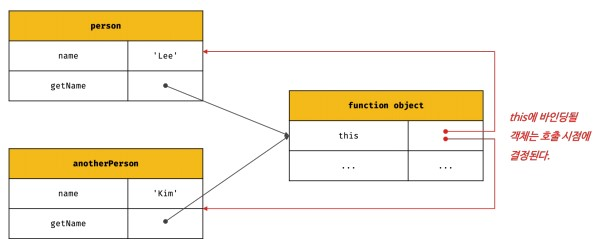
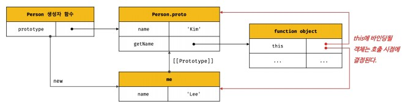
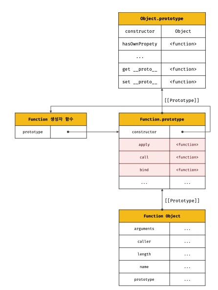

# this
- this는 자신이 속한 객체 또는 자신이 생성할 인스턴스를 가리키는 자기 참조 변수다. this를 통해 자신이 속한 객체 또는 자신이 생성할 인스턴스의 프로퍼티나 메서드를 참조할 수 있다.
- this가 가리키는 값, 즉 this 바인딩은 함수 호출 방식에 의해 동적으로 결정된다.
- this 바인딩은 함수 호출 방식, 즉 함수가 어떻게 호출되었는지에 따라 동적으로 결정된다.
- this는 코드 어디에서든 참조 가능하다. 전역에서도 함수 내부에서도 참조할 수 있다.
- strict mode가 적용된 일반 함수 내부의 this에는 undefined가 바인딩된다. 일반 함수 내부에서 this를 사용할 필요가 없기 때문이다.
- 전역에서 this는 전역 객체 window를 가리킨다.
- 일반 함수 내부에서 this는 전역 객체 window를 가리킨다
- 메서드 내부에서 this는 메서드를 호출한 객체를 가리킨다.
- 생성자 함수 내부에서 this는 생성자 함수가 생성할 인스턴스를 가리킨다. 

## 함수 호출 방식과 this 바인딩
- 함수 호출 방식은 4가지가 있는데 그 방식에 따라 this가 달라진다.
- 일반함수 호출
- 메서드 호출
- 생성자 함수 호출
- function.prototype.apply/call/bind 메서드에 의한 간접 호출

```javascript
// 함수 호출 방식에 따라 동적으로 결정
const foo = function() {
    console.dir(this)
}

// 1. 일반 함수 호출
// 전역 객체 window를 가르킴
foo() // window

// 2. 메서드 호출
// 메서드를 호출한 객체 obj를 가리킨다.
const obj = { foo }
obj.foo() // obj

// 3. 생성자 함수 호출
// 생성자 함수가 생성한 인스턴스를 가리킨다.
new foo() // foo()

// 4. function.prototype.apply/call/bind 메서드에 의한 간접 호출
// 인수에 의해 결정된다.
const bar = { name : 'bar' }

foo.call(bar) // bar
foo.apply(bar) // bar
foo.bind(bar)() // bar
```

## 일반 함수 호출
- 일반 함수로 호출하면 함수 내부의 this에는 전역 객체가 바인딩 된다. 다만 객체의 프로퍼티나 메서드를 참조하기 위한 자기 참조 변수이므로 객체를 생성하지 않는 일반 함수에는 의미가 없다.
- strict mode에서는 undefined가 바인딩된다.
- 메서드 내에서 정의한 중첩 함수도 일반 함수로 호출되면 전역 객체가 바인딩된다.
- 콜백 함수나 중첩함수는 외부 함수를 돕는 헬퍼 함수의 역할을 하므로 외부 함수의 로직을 대신하는 경우가 대부분이다. 그렇기 때문에 외부 로직과 콜백함수의 this를 동일시하기 위해서는 this 대신에 that을 참조하거나 apply, call, bind 메서드를 사용해야 하거나 화살표 함수를 사용해야 한다.

## 메서드 호출
- 메서드를 호출한 객체가 바인딩된다.
- 메서드는 프로퍼티에 바인딩된 함수다. 즉, person 객체의 getName 프로퍼티가 가르키는 함수 객체는 person 객체에 포함된 것이 아니라 독립적으로 존재하는 별도의 객체다. getName 프로퍼티가 함수 객체를 가리키고 있을 뿐이다.

```javascript
const person = {
    name : 'Lee',
    getName() {
        return this.name
    }
}
// getName을 호출한 객체의 name을 반환
console.log(person.getName()) // Lee

const anotherPerson = {
    name : 'kim'
}
// getName 메서드를 another 객체의 메서드로 할당
anotherPerson.getName = person.getName
// getName을 호출한건 anotherPerson
console.log(anotherPerson.getName()) // kim

const getName = person.getName
// 일반 함수로 호출
console.log(getName()) // ''
// window.name이 반환됨
```



- 프로토타입 메서드 내부에서 사용된 this도 동일하다.

```javascript
function Person(name) {
    this.name = name
}
Person.prototype.getName = function() {
    return this.name
}
const me = new Person('Lee')

// getName 메서드를 호출한 객체는 me다
console.log(me.getName()) // lee

Person.prototype.name = 'kim'

// getName 메서드를 호출한 객체는 Person.prototype이다
console.log(Person.prototype.getName()) // kim
```



## 생성자 함수 호출
- 생성자 함수 내부의 this에는 생성자 함수가 생성할 인스턴스가 바인딩 된다.

```javascript
function Cricle(radius){
    
    this.radius = radius
    this.getDiameter = function() {
        return 2 * this.radius
    }
}

const circle1 = new Circle(5)
const circle2 = new Circle(10)

console.log(circle1.getDiameter()) // 10
console.log(circle2.getDiameter()) // 20
```

## Function.prototype.apply / call / bind 메서드에 의한 간접 호출
- apply, call, bind 메서드는 Function.prototype의 메서드다. 즉, 이들 메서드는 모든 함수가 상속받아 사용할 수 있다.




```javascript
function getThisBinding(){
    console.log(arguments)
    return this
}
// this로 사용할 객체
const thisArg = { a: 1 }

// getThisBinding 함수를 호출하면서 인수로 전달할 객체를 전달할 객체를 getThisBinding 함수의 this에 바인딩한다.
// apply 메서드는 호출할 함수의 인수를 배열로 묶어 전달한다.
console.log(getThisBinding.apply(thisArg, [1,2,3]))
// [Arguments] { '0': 1, '1': 2, '2': 3 }
// { a: 1 }

// call 메서드는 호출할 함수의 인수를 쉼표로 구분한 리스트 형식으로 전달한다.
console.log(getThisBinding.call(thisArg, 1,2,3))
// [Arguments] { '0': 1, '1': 2, '2': 3 }
// { a: 1 }
```
- apply와 call 메서드의 본질적인 기능은 함수를 호출하는 것이다. apply와 call 메서드는 함수를 호출하면서 첫 번째 인수로 전달한 특정 객체를 호출한 함수의 this에 바인딩한다.
- apply 메서드는 호출할 함수의 인수를 배열로 묶어 전달한다. call 메서드는 호출한 함수의 인수를 쉼표로 구분한 리스트 형식으로 전달한다. 이처럼 apply와 call 메서드는 호출할 함수에 인수를 전달하는 방식만 다를 뿐 this로 사용할 객체를 전달하면서 함수를 호출하는 것은 동일하다.

- apply와 call 메서드의 대표적인 용도는 arguments 객체와 같은 유사 배열 객체에 배열 메서드를 사용하는 경우다. arguments 객체는 배열이 아니기 때문에 Array.prototype.slice 같은 배열의 메서드를 사용할 수 없으나 apply와 call 메서드를 이용하면 가능하다.

```javascript
function convertArgsToArray() {
  console.log(arguments);

  // arguments 객체를 배열로 변환
  // Array.prototype.slice를 인수 없이 호출하면 배열의 복사본을 생성한다.
  const arr = Array.prototype.slice.call(arguments);

  return arr;
}
const test = convertArgsToArray(1, 2, 3);
console.log(test); // [1,2,3]
```

- function.prototype.bind 메서드는 apply와 call 메서드와 달리 함수를 호출하지 않고 this로 사용할 객체만 전달한다.
- bind 메서드는 내부의 중첩 함수 또는 콜백 함수의 this가 불일치하는 문제를 해결하기 위해 유용하게 사용된다.