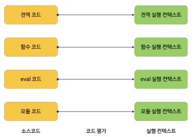
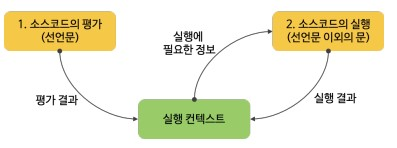
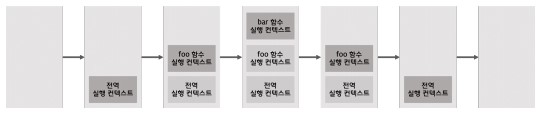
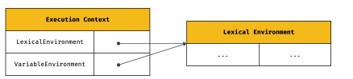

# 실행 컨텍스트
- ECMA 사양은 소스코드를 4가지 타입으로 구분한다. 4가지 타입의 소스코드는 실행 컨텍스트를 생성한다.

|소스코드의 타입|설명|
|--|--|
|전역 코드|전역에 존재하는 소스코드를 말한다. 전역에 정의된 함수, 클래스 등의 내부 코드는 포함되지 않는다.|
|함수 코드|함수 내부에 존재하는 소스코드를 말한다. 함수 내부에 중첩된 함수, 클래스 등의 내부 코드는 포함되지 않는다.|
|eval 코드|빌트인 전역 함수인 eval 함수에 인수로 전달되어 실행되는 소스코드를 말한다|
|모듈 코드|모듈 내부에 존재하는 소스코드를 말한다. 모듈 내부의 함수, 클래스 등의 내부 코드는 포함되지 않는다.|

- 전역 코드 - 전역 코드는 전역 변수를 관리하기 위해 최상위 스코프인 전역 스코프를 생성해야 한다. 그리고 var 키워드로 선언된 전역 변수와 전역 함수를 전역 객체의 프로퍼티와 메서드로 바인딩하고 참조하기 위해 전역 객체와 연결되어야한다.


- 함수 코드 - 함수 코드는 지역 스코프를 생성하고 지역 변수, 매개변수, arguments 객체를 관리해야 한다. 그리고 생성한 지역 스코프를 전역 스코프에서 시작하는 스코프체인의 일원으로 연결해야 한다. 이를 위해 함수 코드가 평가되면 함수 실행 컨텍스트가 생성된다.

- eval 코드 - eval 코드는 strict mode에서 자신만의 독자적인 스코프를 생성한다. 이를 위해 eval 코드가 평가되면 eval 실행 컨텍스트가 생성된다.

- 모듈 코드 - 모듈 코드는 모듈별로 독립적인 모듈 스코프를 생성한다. 이를 위해 모듈 코드가 평가되면 모듈 실행 컨텍스트가 실행된다.



## 소스코드의 평가와 실행
- 자바스크립트 엔진은 소스코드를 2개의 과정 소스코드의 평가와 소스코드의 실행 과정으로 나누어 처리한다.
- 소스코드 평과 과정에서는 실행 컨텍스트를 생성하고 변수, 함수 등의 선언문만 먼저 실행하여 생성된 변수나 함수 식별자를 키로 실행 컨텍스트가 관리하는 스코프에 등록한다.
- 실행과정에서는 선언문을 제외한 소스코드가 순차적으로 실행된다.

```javascript
var x 
x = 1
```
- 위 코드로 생각해 보면 



## 실행 컨텍스트의 역할

```javascript
// 전역 변수 선언
const x = 1
const y = 2

function foo(a) {
  // 지역 변수 선언
  const x = 10
  const y = 20

  // 메서드 호출
  console.log(a + x + y) // 130
}

// 함수 호출
foo(100)

console.log(x + y) // 3
```

- 위 예제를 어떻게 평가하고 실행하는지 확인하겠다.
  1. 전역 코드 평가
    - 소스코드 평과 과정에서 선언문만 먼저 실행한다. 따라서 전역 코드의 변수 선언문과 함수 선언문이 먼저 실행되고, 그 결과 생성된 전역 변수와 전연 함수가 실행 컨텍스트가 관리하는 전역 스코프에 등록된다. 이때 var키워드로 선언된 전역 변수와 함수 선언문으로 정의된 전역 함수는 전역 객체의 프로퍼티와 메서드가 된다.
  2. 전역 코드 실행
    - 전역 코드 평가가 끝나면 전역 코드를 실행한다. 이때 전역 변수에 값이 할당되고 함수가 호출된다. 함숙가 호출되면 실행되던 전역 코드의 실행을 일시 중단하고 코드 실행 순서를 면경하여 함수 내부로 진입한다.
  3. 함수 코드 평가
    - 함수 호출이 이루어지면 함수 코드 평가를 실행하며 매개 변수와 지역 변수 선언문이 먼저 실행되고, 그 결과 생성된 매개변수와 지역 변수가 실행 컨텍스트가 관리하는 지역 스코프에 등록된다. 또한 함수 내부에서 지역 변수처럼 사용할 수 있는 arguments 객체가 생성되어 지역 스코프에 등록되고 this 바인딩도 결정된다.
  4. 함수 코드 실행
    - 함수 코드 평가가 끝나면 함수 코드가 실행된다. 이때 매개변수와 지역 변수에 값이 할당되고 console.log 메서드가 호출된다. 함수 내의 console 객체는 없으므로 지역 스코프를 확인한 후 전역 스코프를 확인하게 된다. 하지만 console은 스코프 체인에 등록되어 있지 않고 전역 객체에 프로퍼티로 존재한다. 이는 전역 객체의 프로퍼티가 전역 변수처럼 전역 스코프를 통해 검색 가능해야 한다는걸 의미한다.
- 이처럼 코드가 실행되려면 스코프를 구분하여 식별자와 바인딩된 값이 관리되어야 한다. 그리고 중첩 관계에 의해 스코프 체인을 형성하여 식별자를 검색할 수 있어야 하고, 전역 객체의 프로퍼티도 전역 변수처럼 검색할 수 있어야한다. 결국 코드가 실행되려면 스코프, 식별자, 코드 실행 순서등의 관리가 필요하다.

- 요약하면 실행 컨텍스트는 식별자(변수, 함수, 클래스 등의 이름)을 등록하고 관리하는 스코프와 코드 실행 순서 관리를 구현한 내부 매커니즘으로, 모든 코드는 실행 컨텍스트를 통해 실행되고 관리된다.


## 실행 컨텍스트 스택


- 실행 컨텍스트는 스택 자료구조로 관리된다. 이를 실행 컨텍스트 스택이라고 부른다.




- 결국 실행 컨텍스트 스택은 실행 순서를 관리한다. 소스코드가 평가되면 실행 컨텍스트가 생성되고 실행 컨텍스트 스택의 최상위에 쌓인다.
- 실행 컨텍스트 스택의 최상위에 존재하는 실행 컨텍스트는 언제나 현재 실행중인 코드의 실행 컨텍스트다. 실행 컨텍스트 스택의 최상위에 존재하는 실행 컨택스트를 실행 중인 실행 컨택스트라 부른다.


## 렉시컬 환경
- 렉시컬 환경은 식별자와 식별자에 바인딩된 값, 그리고 상위 스코프에 대한 참조를 기록하는 자료구조로 실행 컨텍스트를 구성하는 컴포넌트다.

- 실행 컨텍스트 스택이 코드의 실행 순서를 관리한다면 렉시컬 환경은 스코프와 식별자를 관리한다.

- 렉시컬 환경은 스코프를 구분하여 식별자를 등록하고 관리하는 저장소 역할을 하는 렉시컬 스코프의 실체다.

- 실행 컨텍스트는 변수 환경 컴포넌트와 렉시컬 환경 컴포넌트로 구성된다.

- 생성 초기에 렉시컬 환경 컴포넌트와 변수 환경 컴포넌트는 하나의 동일한 렉시컬 환경을 참조한다.



- 위와 같이 실행컨텍스트의 컴포넌트는 렉시컬 환경과 바인딩된다.

- 렉시컬 환경은 환경 레코드 컴포넌트와 외부 렉시컬 환경에 대한 참조 컴포넌트를 가지게 된다.
- 환경 레코드 : 스코프에 포함된 식별자를 등록하고 등록된 식별자에 바인딩된 값을 관리하는 저장소다. 환경 레코드는 소스코드의 타입에 따라 관리하는 내용에 차이가 있다.

- 

## 실행 컨텍스트의 생성과 식별자 검색 과정

```javascript
var x = 1;
const y = 2;

function foo (a) {
  var x = 3;
  const y = 4

  function bar (b) {
    const z = 5;
    console.log(a + b + x + y + z)
  }
  bar(10)
}
foo(20) // 42
```
- 위 코드로 실행 컨텍스트의 생성과 식별자 검색 과정을 작성하겠다.

### 1. 전역 객체 생성
  - 전역 객체는 전역 코드가 평가되기 이전에 생성된다. 전역 객체에는 빌트인 전역 프로퍼티와 전역 함수, 그리고 표준 빌트인 객체가 추가되며 동작 환경에 따라 클라이언트 사이드 web api 또는 특정 환경을 위한 호스트 객체를 포함한다.
  - 전역 객체도 object.prototype을 상속받는다. 전역 객체도 프로토타입 체인의 일원이다.
  ### 2. 전역 코드 평가
    - 소스코드가 로드되면 전역 코드를 평가한다.
    1. 전역 실행 컨텍스트 생성 
    2. 전역 레시컬 환경 생성 
    2.1. 전역 환경 레코드 생성 
    2.1.1. 객체 환경 레코드 생성 
    2.1.2. 선억적 환경 레코드 생성 
    2.2 this 바인딩 
    2.3 외부 렉시컬 환경에 대한 참조 결정   

    1. 전역 실행 컨텍스트를 생성하여 실행 컨텍스트 스택에 푸쉬한다.
    2. 전역 렉시컬 환경을 생성하고 전역 실행 컨텍스트에 바인딩한다.
    - 전역 렉시컬 환경은 2개의 컴포넌트 환경 레코드와 렉시컬 환경에 대한 참조로 구성된다.
    2.1 전역 환경 레코드는 전역 변수를 관리하는 전역 스코프, 전역 객체인 빌트인 전역 프로퍼티와 빌트인 전역 함수, 표준 빌트인 객체를 제공한다. let, const 키워드로 선언한 전역 변수는 전역 객체의 프로퍼티가 되지 않고 개념적인 블록 내에 존재하게 된다.
    - var와 const/let로 선언한 전역 변수를 구분하여 관리하기 위해 객체 환경 레코드와 선언적 환경 레코드로 구성되어있다.
    2.1.1 객체 환경 레코드는 var 키워드로 선언한 전역 변수와 전역 함수, 빌트인 전역 프로퍼티와 빌트인 전역 함수, 표준 빌트인 객체를 관리하고
    2.1.2 선언적 환경 레코드는 let, const 키워드로 선언한 전역 변수를 관리한다.
    2.2 전역 환경 레코드의 내부 슬롯에 this가 바인딩된다. 
    2.3 평가 중인 소스코드를 포함하는 외부 소스코드의 렉시컬 환경, 상위 스코프를 가리킨다. 이때 스코프 체인을 구현한다.
  ### 3. 전역 코드 실행 
    - 전역 코드가 순차적으로 실행된다. 이때 식별자의 값이 할당된다.
    - 식별자 결정을 위해 식별자를 검색할 때는 실행 중인 실행 컨텍스트에서 실별자를 검색하기 시작한다. 선언된 식별자는 실행 컨텍스트의 렉시컬 환경의 레코드에 등록되어 있다.
    - 이때 식별자가 없으면 외부 렉시컬 환경에 대한 참조가 가리키는 렉컬 환경, 상위 스코프로 이동해 검색한다.

  ### 4. 함수 코드 평가
    - 함수가 호출되면 실행중인 실행 컨텍스트는 중지하고 실행 컨텍스트 스택에 실행 컨텍스트가 푸쉬된다.
    1. 함수 실행 컨텍스트 생성
    2. 함수 렉시컬 환경 생성
    2.1 함수 환경 레코드 생성
    2.2 this 바인딩
    2.3 외부 렉시컬 환경에 대한 참조 결정


    1. 함수 실행 컨텍스트를 생성하고  
    2. 함수 렉시컬 환경 생성이 되면 실행 컨텍스트 스택에 푸시된다.
    2.1 함수 환경 레코드는 매개변수, arguments 객체, 함수 내부 지역변수와 중첩함수를 등록하고 관리한다.
    2.2 호출 될때 객체를 가르키는 this가 호출 방식에 따라 결정되고 함수 환경 레코드의 내부 슬롯에 바인딩 된다.
    2.3 만약 함수 정의가 전역에서 이루어졌다면 함수에 외부 렉시컬 환경은 전역 외부 렉시컬 환경을 참조하게 된다.
  ### 5. 함수 코드 실행
    - 순차적으로 실행되기 시작하며 매개변수에 인수가 할당되고 식별자 결정을 위해 실행 중인 실행 컨텍스트의 렉시컬 환경에서 식별자를 검색하기 시작한다.
  ### 예외 사항
    - 예를들어 console 객체를 만나게되면 console은 전역 객체이니 자신에 스코프에 없으면 외부 렉시컬 환경에 대한 참조를 따라 상위 스코프에서 검색하게 된다. 전역 객체는 객체 환경 레코드의 bindingObject를 통해 전역 객체에서 찾을 수 있다.
    - console 객체에 log 메서드를 검색하고 해당 객체에 없을면 프로토타입 체인을 통해 메서드를 검색한다 log는 console 객체가 직접 소유하는 프로퍼티다.
    - 코드가 실행이 종료되면 실행 컨텍스트 스택에서 실행 컨텍스트가 pop되는데 렉시컬 환경을 누군가 참조하고 있다면 렉시컬 환경은 소멸하지 않는다.
## 실행 컨텍스트와 블록 레벨 스코프
- let / const 키워드는 모든 코드 블록을 지역 스코프로 인정하는 블록 레벨 스코프를 따른다.

```javascript
let x = 1

if(true) {
  let x = 10
  console.log(x)
}

console.log(x)
```
- if 문의 코드 블록 내에서 let 키워드로 변수가 선언되었다. if문의 코드 블록을 위한 블록 레벨 스코프를 생성해야한다. 이를 위해 선언적 환경 레코드를 갖는 렉시컬 환경을 새롭게 생성하여 기존의 전역 레시컬 환경을 교체한다. 
- if문이 종료되면 if문 실행 이전의 렉시컬 환경으로 되돌린다.