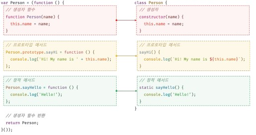

# Class
- 클래스는 생성자 함수와 매우 유사하게 동작하지만 몇 가지 차이가 있다.

1. 클래스를 new 연산자 없이 호출하면 에러가 발생한다. 하지만 생성자 함수를 new 연산자 없이 호출하면 일반 함수로서 호출된다.
2. 클래스는 상속을 지원하는 extends와 super 키워드를 제공한다. 하지만 생성자 함수는 extends와 super 키워드를 지원하지 않는다.
3. 클래스는 호이스팅이 발생하지 않는 것처럼 동작한다. 하지만 함수 선언문으로 정의된 생성자 함수는 함수 호이스팅이, 함수 표현식으로 정의한 생성자 함수는 변수 호이스팅이 발생한다.
4. 클래스 내의 모든 코드에는 암묵적으로 strict mode가 지정되어 실행되며 strict mode를 해제할 수 없다. 하지만 생성자 함수는 암묵적으로 strict mode가 지정되지 않는다.
5. 클래스의 construtor 프로토타입 메서드, 정적 메서드는 모두 프로퍼티 어트리뷰트 `[[Enumerable]]`의 값이 false다. 다시 말해 열겨되지 않는다.

## 클래스 정의

```javascript
// 클래스 선언문
class Person{}

// 익명 클래스 표현식
class Person = class {}

// 기명 클래스 표현식
const Person = class myClass {}
```

- 클래스 몸체에는 0개 이상의 메서드만 정의할 수 있다.
- 클래스 몸체에서 정의할 수 있는 메서드는 constructor(생성자), 프로토타입 메서드, 정적 메서드 세 가지가 있다.

```javascript
class Person {
  constructor(name) {
    this.name = name;
  }

  // 프로토타입 메서드
  sayHi() {
    console.log(`hi! my name is ${this.name}`);
  }

  // 정적 메서드
  static sayHello() {
    console.log("hello!");
  }
}
// 인스턴스 생성
const me = new Person("Lee");

// 인스턴스의 프로퍼티 참조
console.log(me.name);

// 프로토타입 메서드 호출
me.sayHi();
// 정적 메서드 호출
Person.sayHello();

```

- 클래스와 생성자 함수의 정의 방식을 비교해 보면 아래와 같다.



## 클래스 호이스팅
- 클래스 선언문으로 정의한 클래스는 함수 선언문과 같이 소스코드 평가 과정, 즉 런타임 이전에 먼저 평가되어 함수 객체를 생성한다.
- 이때 클래스가 평가되어 생성된 함수 객체는 생성자 함수로서 호출할 수 있는 함수, 즉 constructor다. 생성자 함수로서 호출할 수 있는 함수는 함수 정의가 평가되어 함수 객체를 생성하는 시점에 프로토타입도 더불어 생성된다. 프로토타입과 생성자 함수는 단독으로 존재할 수 없고 언제나 쌍으로 존재하기 때문이다. 단, 클래스는 클래스 정의 이전에 참조할 수 없다.
- 클래스도 let const키워드로 선언한 변수처럼 호이스팅이 되고 TDZ가 발생한다.


## 인스턴스 생성
- class는 new 연산자를 사용하지 않으면 오류가 발생하므로 반드시 new 연산자와 함께 호출해야 한다.
- 기명 함수 표현식과 마찬가지로 클래스 표현식에서 사용한 클래스 이름은 외부 코드에서 접근 불가능하기 때문에 식별자를 사용해 인스턴스를 생성해야한다.

## 프로토타입 메서드
- 클래스 몸체에서 정의한 메서드는 생성자 함수에 의한 객체 생성 방식과는 다르게 클래스의 prototype 프로퍼티에 메서드를 추가하지 않아도 기본적으로 프로토타입 메서드가 된다.

## 정적 메서드 
- 클래스에서는 메서드에 static 키워드를 붙이면 정적 메서드가 된다.
- 정적 메서드는 프로토타입 메서드처럼 인스턴스로 호출하지 않고 클래스로 호출한다.
- 정적 메서드는 인스턴스로 호출할 수 없다.
```javascript
class Person {
  constuctor(name) {
    this.name = name 
  }

  // 정적 메서드
  static sayHi() {
    console.log('Hi')
  }
}
```

## 정적 메서드와 프로토타입 메서드의 차이
1. 정적 메서드와 프로토타입 메서드는 자신이 속해 있는 프로토타입 체인이 다르다.
2. 정적 메서드는 클래스로 호출하고 프로토타입 메서드는 인스턴스로 호출한다.
3. 정적 메서드는 인스턴스 프로퍼티를 참조할 수 없지만 프로토타입 메서드는 인스턴스 프로퍼티를 참조할 수 있다.

- 정리하면 정적 메서드는 this가 클래스 객체를 가리키고 프로토타입 메서드는 this가 생성될 인스턴스를 가리키는 것이다.
- 정적 메서드는 애플리케이션 전역에서 유틸리티 함수를 전역 함수로 정의하지 않고 메서드로 구조화할 때 유용하다.

## 클래스에서 정의한 메서드의 특징
1. function 키워드를 생략한 메서드 축약 표현을 사용한다.
2. 객체 리터럴과는 다르게 클래스에 메서드를 정의할 때는 콤마가 필요 없다.
3. 암묵적으로 strict mode로 실행된다.
4. for ... in 문이나 Object.keys 메서드 등으로 열겨할 수 없다. 즉, 프로퍼티의 열거 가능 여부를 나타내며, 불리언 값을 갖는 프로퍼티 어트리뷰트 `[[Enumerable]]`의 값이 false다
5. 내부 메서드 `[[Construct]]`를 갖지 않는 non-constructor다. 따라서 연산자와 함께 호출할 수 없다.


## 상속에 의한 클래스 확장
- 프로토타입 기반 상속은 프로토타입 체인을 통해 다른 객체의 자산을 상속 받는 개념이지만 상속에 의한 클래스 확장은 키존 클래스를 상속받아 새로운 클래스를 확장하여 정의하는 것이다.

```javascript
class Animal {
  constructor(age, weight) {
    this.age = age;
    this.weigth = weight;
  }

  eat() {
    return "eat";
  }
  move() {
    return "move";
  }
}

class Bird extends Animal {
  fly() {
    return "fly";
  }
}

const bird = new Bird(1, 5);
console.log(bird instanceof Bird); // true
console.log(bird instanceof Animal); // true

console.log(bird.eat()); // eat
console.log(bird.move()); // move
console.log(bird.fly()); // fly

```

- 클래스는 상속을 통해 다른 클래스를 확장할 수 있는 문법인 extends 키워드가 기본적으로 제공된다. 

## extends 키워드 
- 상속을 통해 클래스를 확장하려면 extends 키워드를 사용하여 상속받을 클래스를 정의한다.
- 상속을 통해 확장된 클래스를 서브클래스라 부르고, 서브클래스에게 상속된 클래스를 수퍼클래스라 부른다. 서브 클래스를 파생 클래스 또는 자식 클래스, 수퍼클래스를 베이스 클래스 또는 부모 클래스라고 부르기도 한다.
- 수퍼클래스와 서브클래스는 인스턴의 프로토타입 체인뿐 아니라 클래스 간의 프로토타입 체인도 생성한다. 이를 통해 프로토타입 메서드, 정적 메서드 모두 상속이 가능하다.

## 동적 상속
- extends 키워드는 클래스뿐만 아니라 생성자 함수를 상속받아 클래스를 확장할 수도 있다. 단 extends 키워드 앞에는 반드시 클래스가 와야한다.

```javascript
function Base(a) {
  this.a = a;
}

class Derived extends Base {}
const derived = new Derived(1);
console.log(derived); // Derived { a: 1 }

function Base1() {}

class Base2 {}

let condition = true;

class Example extends (condition ? Base1 : Base2) {}

const example = new Example();
console.log(example); // Example {}

console.log(example instanceof Base1); // true
console.log(example instanceof Base2); // false

```

- extends 키워드 다음에는 클래스 뿐만 아니라 `[[Construct]]` 내부 메서드를 갖는 함수 객체로 평가될 수 있는 모든 표현식을 사용할 수 있다.

## 표준 빌트인 생성자 함수 확장
- extends 키워드는 String, Number, Array 같은 표준 빌트인 객체도 확장하여 사용할 수 있다.

