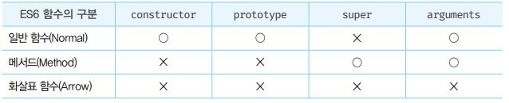

# ES6 함수의 추가 기능
- ES6 이전의 모든 함수는 일반 함수로서 호출할 수 있는 것은 물론 생성자 함수로서 호출할 수 있다.
- 즉 ES6 이전의 모든 함수는 callable이면서 constructor이다.
- 주의할 점은 ES6 이전에 일반적으로 메서드라고 부르던 객체에 바인딩된 함수도 callable이며 constructor라는 것이다. 따라서 객체에 바인딩된 함수도 일반 함수로서 호출할 수 있는 것은 물론 생성자 함수로서 호출 할 수도 있다.

- ES6 이전의 모든 함수는 사용 목적에 따라 명확한 구분이 없으므로 호출 방식에 특별한 제약이 없고 생성자 함수로 호출되지 않아도 객체를 생성한다. 이는 혼란스러우며 실수를 유발할 가능성이 있고 성능에도 좋지 않다. 

- 이러한 문제를 해결하기 위해 ES6에서는 함수를 사용 목적에 따라 세 가지 종류로 명확히 구분했다.



## 메서드

- ES6 사양에서 메서드는 메서드 축약 표현으로 정의된 함수만을 의미한다.

```javascript
const obj = {
    x = 1,
    // foo는 메서드이다. 
    foo() { return this.x; },
    // bar에 바인딩된 함수는 메서드가 아닌 일반 함수다. 
    bar : function() { return this.x; }
}

new obj.foo() // typeError
new obj.bar() // bar{}
```

- ES6 사양에서 정의한 메서드는 인스턴스를 생성할 수 없는 non-constructor다. 따라서 ES6 메서드는 생성자 함수로서 호출할 수 없다.
- ES6 메서드는 자신을 바인딩한 객체를 가리키는 내부 슬롯 `[[HomeObject]]`를 갖는다.
- 메서드를 정의할 때 프로퍼티 값으로 익명 함수 표현식을 할당하는 ES6 이전의 방식은 사용하지 않는 것이 좋다.

## 화살표 함수 
- 화살표 함수는 function 키워드 대신 화살표를 사용하여 기존의 함수 정의 방식보다 간략하게 함수를 정의할 수 있고, 내부 동작도 간략하며, this가 전역 객체를 가리키는 문제를 해결하기 위한 대안으로 유용하다.

- 함수 정의 : 화살표 함수는 함수 선언문으로 정의할 수 없고 함수 표현식으로 정의해야 한다. 호출 방식은 기존 함수와 동일하다.

```javascript
const multiply = (x,y) => x * y
multiply(2, 3)
```

- 매개변수 선언 : 매개변수가 여러 개인 경우 소괄호 안에 매개변수를 선언한다.
- 매개변수가 한 개인 경우 소괄호를 생략할 수 있다.
- 매개변수가 없는 경우 소괄호를 생략할 수 없다.

```javascript
const arrow = (x,y) => {...}
const arrow = x => {...}
const arrow = () => {...}
```

- 함수 몸체 정의 : 함수 몸체가 하나의 문으로 구성된다면 함수 몸체를 감싸는 중괄호를 생략할 수 있다.

- 함수 몸체가 하나의 문으로 구성된다 해도 함수 몸체의 문이 표현식이 아닌 문이라면 중괄호를 생략할 수 없다.

- 객체 리터럴을 반환하는 경우 객체 리터럴을 소괄호로 감싸 주어야 한다.
```javascript
const power = x => x ** 2
const power = x => {return x ** 2}

const arrow = () =>  const x = 1 // error
const arrow = () => { const x = 1 }

const create = (id, content) => ({ id, content })

// {id,content}를 함수 몸체 내의 쉼표 연산자문으로 해석한다.
const create = (id, content) => {id, content } // error 
```

- 함수 몸체가 여러 개의 문으로 구성된다면 함수 몸체를 감싸는 중괄호 `{}`를 생략할 수 없다. 이때 반환값이 있다면 명시적으로 반환해야 한다.

- 화살표 함수도 즉시 실행 함수로 사용할 수 있다.
```javascript
const person = (name => ({
    sayHi() { return `Hi? My name is ${name}`}

}))('Lee')

console.log(person.sayHi())
```

- 화살표 함수도 일급 객체이므로 고차 함수에 인수로 전달할 수 있다.

## 화살표 함수와 일반 함수의 차이
- 화살표 함수는 인스턴스를 생성할 수 없는 non-constructor다
    - 화살표 함수는 인스턴스를 생성할 수 없으므로 prototype 프로퍼티가 없고 프로토타입도 생성하지 않는다.

- 중복된 매개변수 이름을 선언할 수 없다.
    - 일반 함수는 중복된 매개변수 이름을 선언해도 에러가 발생하지 않는다.

```javascript
const arrow = (a, a) => a + a // SyntaxError
```

- 화살표 함수는 함수 자체의 this, arguments, super, new.target 바인딩을 갖지 않는다.
- 따라서 화살표 함수 내부에서 this, arguments, super, new.target을 참조하면 스코프 체인을 통해 상위 스코프의 this, arguments, super, new.target을 참조한다.


## this 
- 화살표 함수는 함수 자체의 this 바인딩을 갖지 않는다. 따라서 화살표 함수 내부에서 this를 참조하면 상위 스코프의 this를 그대로 참조한다. 이를 lexical this라 한다.

// 다음 시간에


