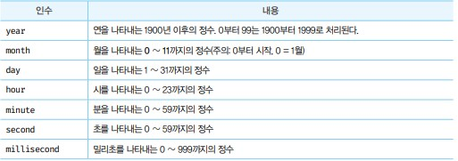

# Date
- Date는 날짜와 시간을 위한 메서들 제공하는 빌트인 객체이면서 생성자 함수다.
- UTC는 국제 표준시를 말하고, KST(한국 표준시)는 UTC보다 9시간이 빠르기 때문에 UTC에 9시간을 더해야 KST를 구할 수 있다.
- 현재 날짜와 시간은 자바스크립트 코드가 실행된 시스템의 시계에 의해 결정된다.

## Date 생성자 함수
- Date 생성자 함수로 생성한 Date 객체는 내부적으로 날짜와 시간을 나타내는 값을 갖는데 이 값은 1970년 1월 1일 00:00:00(UTC)를 기점으로 Date 객체가 나타내는 잘짜와 시간까지의 밀리초를 나타낸다.


## new Date()
- Date 생성자 함수를 인수 없이 new 연산자와 함께 호출하면 현재 날짜와 시간을 가지는 Date 객체를 반환한다. 
- Date 객체는 내부적으로 날짜와 시간을 나타내는 정수값을 갖지만 Date 객체를 콘솔에 출력하면 기본적으로 날짜와 시간 정보를 출력한다.

```javascript
new Date() // 2021-11-17T06:29:28.398Z UTC기준

Date() // Wed Nov 17 2021 15:29:28 GMT+0900 (GMT+09:00) 시스템 나라별 시간 기준
```

## new Date(milliseconds)
- Date 생성자 함수에 숫자 타입의 밀리초를 인수로 전달하면 1970년 1월 1일 00:00:00(UTC)을 기준으로 인수로 전달된 밀리초만큼 경과한 날짜와 시간을 나타내는 Date 객체를 반환한다.

## new Date(dateString)
- Date 생성자 함수에 날짜와 시간을 나타내는 문자열을 인수로 전달하면 지정된 날짜와 시간을 나타내는 Date 객체를 반환한다. 이때의 인수는 Date.parse 메서드에 의해 해석 가능한 형식이어야한다.

```javascript
const test = new Date('May 26, 2020, 10:00:00')

console.log(test) // 2020-05-26T01:00:00.000Z
```

## new Date(year, month[,day, hour, minute, second, millisecond])
- Date 생성자 함수에 연, 월, 시, 분, 초, 밀리초를 의미하는 숫자를 인수로 전달하면 지정된 날짜와 시간을 나타내는 Date 객체를 반환한다. 이때 연, 월은 반드시 지정해야 하며, 지정하지 않은 옵션 정보는 0 또는 1로 초기화가된다.



```javascript
console.log(new Date(2020, 2)) // 2020-02-28T15:00:00.000Z UTC 기준 3/1 00시는 KST 15시이다. 

console.log(new Date(2020, 2, 26, 10, 00, 00, 0)) //2020-03-26T01:00:00.000Z

// 가장 가독성 좋은 형식
console.log(new Date('2020/3/26/10:00:00:00'))
```

## Date 메서드
- Date.now : 1970년 1월 1일 00:00:00(UTC)을 기점으로 현재 시간까지 경과한 밀리초를 숫자로 반환한다.

- Date.parse : 1970년 1월 1일 00:00:00(UTC)을 기점으로 인수로 전달된 지정 시간(new Date(dateString)의 인수와 동일한 형식)까지의 밀리초를 숫자로 반환한다.

- Date.UTC : 1970년 1월 1일 00:00:00(UTC)을 기점으로 인수로 전달된 지정 시간까지의 밀리초를 숫자로 반환한다.

- Date.prototype.getFullYear : Date 객체의 연도를 나타내는 정수를 반환한다.

- Date.prototype.setFullYear : Date 객체에 연도를 나타내는 정수를 설정한다. 연도 이외에 옵션으로 월 일도 설정할 수 있다.

- Date.prototype.getMonth : Date 객체의 월을 나타내는 0 ~ 11의 정수를 반환한다. 1월은 0, 12월은 11이다.

- Date.prototype.setMonth : Date 객체에 월을 나타내는 0 ~ 11의 정수를 설정한다. 1월은 0, 12월은 11이다. 월 이외에 옵션으로 일도 성정할 수 있다.

- Date.prototype.getDate : Date 객체의 날짜 (1 ~ 31)를 나타내는 정수를 반환한다.

- Date.prototype.setDate : Date 객체의 날짜 (1 ~ 31)를 나타내는 정수를 설정한다.

- Date.prototype.getDay : Date 객체의 요일(0~6)일요일 = 0 토요일은 = 6을 나타내는 정수를 반환한다.

- Date.prototype.getHours : Date 객체의 시간(0~23)을 나타내는 정수를 반환한다.

- 이하 get/set Hours, Minutes, Seconds, Milliseconds도 마찬가지로 동일하다.

- toDateString, toTimeString, toIOSString, toLocaleString, toLocaleTimeString
```javascript
const today = new Date('2020/7/24/12:30')

console.log(today.toString()) // Fri Jul 24 2020 12:30:00 GMT+0900 (GMT+09:00)
console.log(today.toDateString()) // Fri Jul 24 2020
console.log(today.toTimeString()) // 12:30:00 GMT+0900 (GMT+09:00)
console.log(today.toISOString()) // 2020-07-24T03:30:00.000Z

// toLocaleString 인수를 생략한 경우 브라우저가 동작 중인 시스템의 로컬을 적욕한다.
console.log(today.toLocaleString()) // 2020. 7. 24. 오후 12:30:00
console.log(today.toLocaleString('ko-KR')) // 2020. 7. 24. 오후 12:30:00
console.log(today.toLocaleString('en-US')) // 7/24/2020, 12:30:00 PM

console.log(today.toLocaleTimeString('ko-KR')) // 오후 12:30:00
console.log(today.toLocaleTimeString('en-US')) // 12:30:00 PM


```