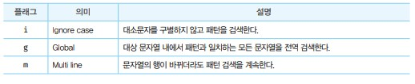

# 정규 표현식
- 정규 표현식은 문자열을 대상으로 패턴 매칭 기능을 제공한다. 패턴 매칭 기능이란 특정 패턴과 일치하는 문자열을 검색하거나 추출 또는 치환할 수 있는 기능을 말한다.

## 정규 표현식의 생성
- 정규 표현식 객체를 생성하기 위해서는 정규 표현식 리터럴과 RegExp 생성자 함수를 사용할 수 있다.  일반적인 방법은 정규 표현식 리터럴을 사용하는 것이다.


- 위처럼 정규 표현식 리터럴은 패턴과 플래그로 구성된다.

```javascript
const target = 'Is this all there is?';

// 패턴: is
// 플래그 : i => 대소문자를 구별하지 않고 검색한다.
const regexp = /is/i;

// test 메서드는 target 문자열에 대해 정규 표현식 regexp의 패턴을 검색하여 
// 매칭 결과를 불리언 값으로 반환한다.
regexp.test(target); // true
```

- RegExp 생성자 함수를 사용하여 RegExp 객체를 생성할 수도 있다.

```javascript
const target = 'Is this all there is?';
const regexp = new RegExp(/is/i)
regexp.test(target) // true
```

## RegExp 메서드
- RegExp.prototype.exec : 인수로 전달받은 문자열에 대해 정규 표현식의 패턴을 검색하여 매칭 결과를 배열로 반환한다. 매칭 결과가 없는 경우 null을 반환한다.

```javascript
const target = 'Is this all there is?';

const regexp = /is/
console.log(regexp.exec(target)) // [ 'is', index: 5, input: 'Is this all there is?', groups: undefined ]
```
- exec 메서드는 문자열 내의 모든 패턴을 검색하는 g플래그를 지정해도 첫 번째 매칭 결과만 반환하므로 주의해야 한다.

- RegExp.prototype.test : 인수로 전달받은 문자열에 대해 정규 표현식의 패턴을 검색하여 매칭 결과를 불리언 값으로 반환한다.


- String.prototype.match : 대상 문자열과 인수로 전달받은 정규 표현식과의 매칭 결과를 배열로 반환한다.

```javascript
const target = 'Is this all there is?';

const regexp = /is/g

console.log(target.match(regexp)) // [ 'is', index: 5, input: 'Is this all there is?', groups: undefined ]
```
- exec 메서드는 문자열 내의 모든 패턴을 검색하는 g플래그를 지정해도 첫 번째 매칭 결과만 반환한다. 하지만 match 메서드는 g 플래그가 지정되면 모든 매칭 결과를 배열로 반환한다.

```javascript
const target = 'Is this all there is?';
const regexp = /is/g

console.log(target.match(regexp)) // [ 'is', 'is' ]
console.log(regexp.exec(target)) // [ 'is', index: 5, input: 'Is this all there is?', groups: undefined ]
```

## 플래그
- 패턴과 함께 정규 표현식을 구성하는 플래그는 정규 표현식의 검색 방식을 설정하기 위해 사용한다. 플래그는 총 6개 있다. 그 중 중요한 3개의 플래그는 아래와 같다.



- 플래그는 옵션이므로 선택적으로 사용할 수 있으며, 순서와 상관없이 하나 이상의 플래그를 동시에 설정할 수도 있다. 플래그를 생략할 경우 대소문자를 구별하며 첫 번째 매칭된 대상만 검색하고 종료한다.

```javascript
const target = 'Is this all there is?';

target.match(/is/g) // ['is', 'is']
target.match(/is/gi) //[ 'Is', 'is', 'is' ]
```

## 패턴
- 문자열의 일정한 규칙을 표현기 위해 사용한다. 패턴은 /로 열고 닫으며 문자열의 따옴표는 생략한다. 따옴표를 포함하면 따옴표까지도 패턴에 포함되어 검색된다.
- 패턴은 메타문자 또는 기호로 표현할 수 있다.

- 임의의 문자열 검색 : `.`은 임의의 문자 한개를 의미한다. 문자의 내용은 무엇이든 상관없다. `...` 작성하면 문자의 내용과 상관없이 3자리 문자열과 매치한다. 공백도 포함된다.

- 반복 검색 : {m,n}은 최소 m번, 최대 n번 반복되는 문자열을 의미한다. 콤마 뒤에 공백이 있으면 정상 동작하지 않으므로 주의해야한다.
```javascript
const target = 'A AA B BB Aa Bb AAA';

console.log(target.match(/A{1,2}/g)) // [ 'A', 'AA', 'A', 'AA', 'A' ]

// n, 뒤에 공백을 작성하지 않도록 주의해야한다.
console.log(target.match(/A{1, 2}/g)) // null

// n,은 최소 n번 이상 반복되는 문자열을 의미한다.
console.log(target.match(/A{2,}/g)) // [ 'AA', 'AAA' ]
```

- `+`는 앞선 패턴이 최소 한번 이상 반복되는 문자열을 의미한다. 즉 +는 {1,}과 같다. 위 예제로는 /A+/와 /A{1,}/이 동일하다.

- `?`는 앞선 패턴이 최대 한 번(0번 포함) 이상 반복되는 문자열을 의미한다. 즉 ?는 {0,1}과 같다.

```javascript
const target = 'color colour'

// 'colo' 다음 'u'가 최대 한번(0번 포함)이상 반복되고 'r'이 이어지는
// 문자열 'color', 'colour'를 전역 검색한다.
console.log(target.match(/colou?r/g)) // [ 'color', 'colour' ]
```

## OR 검색
- |은 OR의 의미를 갖는다 

```javascript
const target = 'A AA B BB Aa Bb'
console.log(target.match(/A|B/g)) //   ['A', 'A', 'A', 'B', 'B', 'B', 'A', 'B']
```

- 분해되지 않은 단어 레벨로 검색하기 위해서는 +를 함께 사용한다.

```javascript
const target = 'A AA B BB Aa Bb'
console.log(target.match(/A+|B+/g)) // [ 'A', 'AA', 'B', 'BB', 'A', 'B' ]
```

- 위를 간단히 표현하는 방식은 `[]` 내의 문자는 or로 동작한다 그 뒤에 +를 사용하면 앞선 배턴을 한 번 이상 반복한다

```javascript
const target = 'A AA B BB Aa Bb'
console.log(target.match(/[AB]+/g)) // [ 'A', 'AA', 'B', 'BB', 'A', 'B' ]
```

- A-Z : 대문자 영단어, a-z : 소문자 영단어, 0-9 : 숫자, \d : 숫자, \D : 숫자가 아닌 문자, \w : 알파벳, 숫자, 언더스코어, \W : 알파벳, 숫자, 언더스코어가 아닌 문자

## NOT 검색
- [...] 내의 `^`는 NOT을 의미한다. 예를들어 [^0-9]는 숫자를 제외한 문자를 의미한다. 

## 시작 위치로 검색
= [...] 밖의 ^은 문자열의 시작을 의미한다.
```javascript
const target = 'http://www.naver.com'
console.log(/^[http]+/.test(target)) // true
```

## 마지막 위치로 검색
- $는 문자열의 마지막을 의미한다.
```javascript
const target = 'www.naver.com'
console.log(/.com$/.test(target)) // true
```

## 자주 사용하는 정규 표현식
- 특정 단어로 시작하는지 검사할 때 

```javascript
const url = 'https://example.com';

// http로 시작하고 s는 있거나 말거나 ://가 존재하니?
console.log(/^https?:\/\//.test(url)) // true
```

- 특정 단어로 끝나는지 검사
```javascript
const fileName = 'index.html'

console.log(/html/.test(fileName)) // true
```

- 숫자로만 이루어진 문자열인지 검사

```javascript
const target = '12345'

// ^\d 숫자로 시작하며 + 최소 한번이상 반복되며 끝도 숫자
console.log(/^\d+$/.test(target))
```

- 아이디로 사용 가능한지 검사
```javascript
const id = 'abC123'
// 숫자와 영단어만 사용가능하며 글자수가 최소 4~10 까지로 이루어져 있는 단어인지
console.log(/^[a-z0-9]{4,10}$/i.test(id)) // true
```

- 메일 주소 형식에 맞는지 검사

```javascript
const email = 'test@naver.com'
console.log(/^[0-9a-zA-Z]([-_.]?[0-9a-zA-Z])*@[0-9a-zA-Z]([-_.]?[0-9a-zA-Z])*.[a-zA-Z]{2,3}$/i.test(email)) //true
```

- 핸드폰 번호 형식에 맞는지 검사

```javascript
const cellphone = '010-1234-5678'

console.log(/^\d{3}-\d{4}-\d{4}$/.test(cellphone)) // true
```

- 특수 문자 포함 여부
```javascript
const target = 'abc#123'
/[^A-Za-z0-9]/gi.test(target) // true

// 특수 문자를 제거할 때는
const targetDel = target.replace(/[^A-Za-z0-9]/gi, '')
console.log(targetDel) // abc123
```