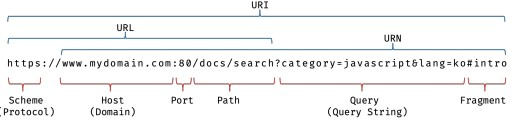
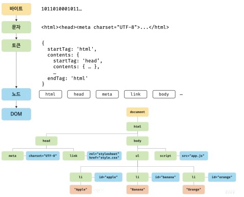

# 브라우저의 렌더링 과정
- 브라우저가 HTML, CSS, 자바스크립트로 작성된 텍스트 문서를 어떻게 파싱 하여 브라우저에 보여주는 과정

- 파싱 : 프로그래밍 언어의 문법에 맞게 작성된 텍스트 문서를 읽어 들여 실행기 위해 텍스트 문서의 문자열을 토근으로 분해하고, 토큰에 문법적 의미와 구조를 반영하여 트리 구조의 자료구조인 파스 트리를 생성하는 일련의 과정을 말한다. 일반적으로 파싱이 완료된 이후에는 파스 트리를 기반으로 중간 언어인 바이트코드를 생성하고 실행한다. 

- 렌더링 : HTML, CSS, 자바스크립트로 작성된 문서를 파싱하여 브루아저에 시각적으로 출력하는 것을 말한다.

## 브라우저 렌더링 과정
1. 브라우저는 HTML, CSS, 자바스크립트, 이미지, 폰트 파일 등 렌더링에 필요한 리소스를 요청하고 서버로부터 응답을 받는다.

2. 브라우저의 렌더링 엔진은 서버로부터 응답된 HTML과 CSS를 파싱하여 DOM과 CSSOM을 생성하고 이들을 결합하여 렌더 트리를 생성한다.

3. 브라우저의 자바스크립트 엔진은 서버로부터 응답된 자바스크립트를 파싱하여 AST를 생성하고 바이트코드로 변환하여 실행한다. 이때 자바스크립트는 DOM API를 통해 DOM이나 CSSOM을 변경할 수 있다. 변경된 DOM과 CSSOM은 다시 렌터 트리로 결합된다.

4. 렌더 트리를 기반으로 HTML 요소의 레이아웃을 계산하고 브라우저 화면에 HTML 요소를 페인팅한다.

## 요청과 응답
- 브라우저의 핵심 기능은 필요한 리소스를 서버에 요청하고 서버로부터 응답 받아 브라우저에 시각적으로 렌더링하는 것이다.

- 서버에 요청하기 위해 브라우저는 주소창을 제공한다.
- 브라우저 주소창에 URL을 입력하고 엔터 키를 누르면 URL의 호스트 이름이 DNS를 통해 IP 주소로 변환되고 이 IP 주소를 갖는 서버에게 요청을 전송한다.

- 주소창에 www.naver.com을 입력하면 암묵적으로 index.hmtl을 요청해 응답 받는다.

## HTTP 1.1과 HTTP 2.0 

- HTTP/1.1 : 기본적으로 커넥션당 하나의 요청과 응답만 처리한다. 즉, 여러 개의 요청을 한번에 전송할 수 없고 응답 또한 마찬가지다. 

- HTTP/2.0 : 커넥션당 여러 개의 요청과 응답, 즉 다중 요청/응답이 가능하다. 여러 리소스의 동시 전송이 가능하므로 HTTP/1.1보다 50% 빠르다고 알려져 있다.

## HTML 파싱과 DOM 생성

- HTML 문서는 문자열로 이루어진 순수한 텍스트다. HTML 문서를 부라우저에 시각적인 픽셀로 렌더링하려면 HTML 문서를 브라우저가 이해할 수 있는 자료구조로 변환하여 메모리에 저장해야 한다.

1. 서버에 존재하던 HTML 파일이 브라우저의 요청에 의해 응답된다. 이때 서버는 브라우저가 요청한 HTML 파일을 읽어 들여 메모리에 저장한 다음 메모리에 저장된 바이트를 인터넷을 경유하여 응답한다.

2. 브라우저는 서버가 응답한 HTML 문서를 바이트 형태로 응답받는다. 응답된 바이트 형태의 HTML 문서는 meta 태그의 charset에 의해 인코딩되어 문자열로 변환된다.

3. 문자열로 변환된 html 문서를 읽어 들여 문법적 의미를 갖는 코드의 최소 단위인 토큰들로 분해한다.

4. 각 토큰들을 객체로 변화하여 노드들을 생성한다. 토큰의 내용에 따라 문서 노드, 요소 노드, 어트리뷰트 노드, 텍스트 노드가 생성된다. 노드는 이후 DOM을 구성하는 기본 요소가 된다.

5. HTML 문서는 HTML 요소들의 집합으로 이루어지며 HTML 요소는 중첩 관계를 갖는다. 즉, HTML 요소의 컨텐츠 영역에는 텍스트뿐만 아니라 다른 HTML 요소도 포함될 수 있다. 이때 HTML 요소 간에는 중첩 관계에 의해 부자 관계가 형성된다. 부자 관계를 반영하여 모든 노드들을 트리 자료구조로 구성하고 이런 자료구조를 DOM이라 부른다.

## CSS 파싱과 CSSOM 생성

- HTML을 한줄 씩 파싱하다 CSS를 로드하는 link 태그나 style 태그를 만나면 DOM 생성을 일시 중단한다.
- href 어트리뷰트에 지정된 css파일을 서버에 요청해 로드한 CSS 파일이나 style 태그 내의 CSS를 HTML과 동일한 파싱 과정을 거치며 해석해 CSSOM을 생성한다. 그후 CSS 파싱을 완료하면 DOM 생성을 재개한다.

## 렌더 트리 생성
- 렌더링 엔진은 서버로부터 응답된 HTML과 CSS를 파싱하여 각각 DOM과 CSSOM를 생성한다. 그리고 DOM과 CSSOM은 렌더링을 위해 렌더 트리로 결합된다.
- 렌더 트리는 렌더링을 위한 트리 구조의 자료구조다. 렌더 트리는 브라우저 화면에 렌더링 되는 노드만으로 구성된다(display : node, meta태그 script 태그 등은 포함되지 않는다.)

- 이후 완성된 렌더 트리는 각 HTML 요소의 레이아웃을 계산하는 데 사용되며 브라우저 화면에 픽셀을 렌더링하는 페인팅 처리에 입려된다.

- 렌더링 과정은 반복해서 실행될 수 있다.
  - 자바스크립트에 의한 노드 추가 또는 삭제
  - 브라우저 창의 리사이징에 의한 뷰포트 크기 변경
  - HTML 요소의 레이아웃에 변경을 발생시키는 width/height, margin, padding, border등의 스타일 변경
- 레이아웃 계산과 페인팅을 다시 실행하는 리렌더링은 비용이 많이 들기 때문에 성능에 악영향을 준다. 따라서 가급적 리렌더링이 빈번하게 발생하지 않도록 주의할 필요가 있다.

## 리플로우와 리페인트
- 자바스크립트 코드에 DOM이나 CSSOM을 변경하는 DOM API가 사용된 경우 DOM이나 CSSOM이 변경된다. 이때 변경된 DOM과 CSSOM은 다시 렌더 트리로 결합되고 변경된 렌더 트리를 기반으로 레이아웃과 페인트 과정을 거쳐 브라우저의 화면에 다시 렌더링한다. 이를 리플로우, 리페인트라 한다.

- 리플로우 : 레이아웃 계산을 다시 하는 것을 말하며, 노드 추가/삭제, 요소의 크기/위치 변경, 윈도우 리사이징 등 레이아웃에 영향을 주는 변경이 발생한 경우에 한하여 실행된다.

- 리페인트 : 재결합된 렌더 트리를 기반으로 다시 페인트를 하는 것을 말한다.

- 레이아웃에 영향이 없는 경우는 리페인트만 실행된다.

## 자바스크립트 파싱에 의한 HTML 파싱 중단
- 렌더링 엔진과 자바스크립트 엔진은 직렬적으로 파싱을 수행한다.
- 즉, 위에서 아래 방향으로 순차적으로 파싱하고 실행하는데 script를 만나게 되면 dom생성을 중지하고 javascript를 파싱하고 실행하게 된다. 그렇기 떄문에 script를 불러오는 위치는 매우 중요하다.

- async 어트리뷰트 - script 태그에 순서와 상관없이 로드가 완료된 자바스크립트부터 먼저 실행된다.

- defer 어트리뷰트 - script 태그를 만나면 javascript 로드는 하지만 실행은 DOM이 전부 생성이 완료된 이후 실행이 된다.