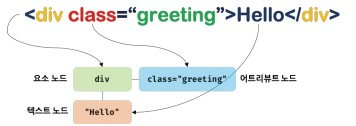
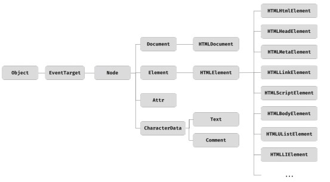
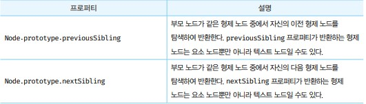
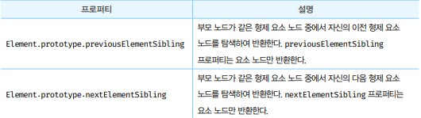
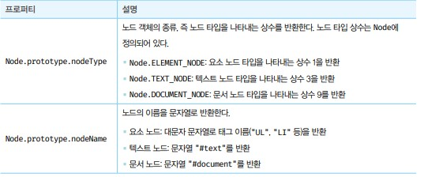
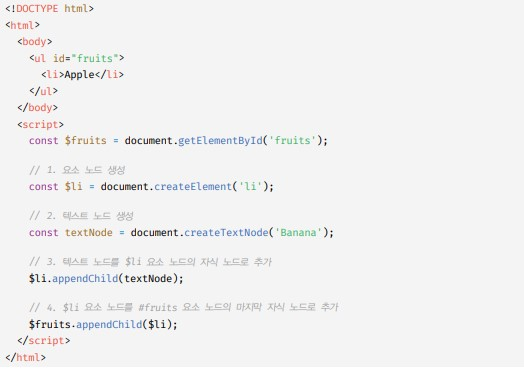
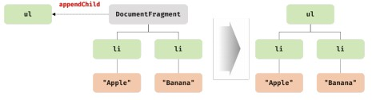
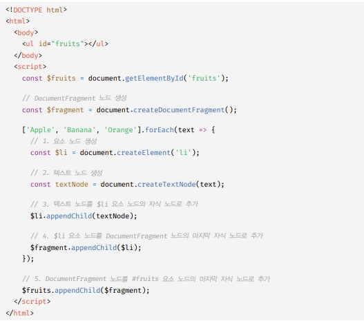

# DOM
- DOM은 HTML 문서의 게층적 구조와 정보를 표현하며 이를 제어할 수 있는 API, 즉 프로퍼티와 메서드를 제공하는 트리 자료구조다.

## 노드

- HTML 요소는 렌더링 엔진에 의해 파싱되어 DOM을 구성하는 요소 노드 객체로 변환된다. 이때 HTML 요소의 어트리뷰트는 노드로, HTML 요소의 켁스트 컨텐츠는 텍스트 노드로 변환된다.



- HTML 요소는 중첩 관계를 갖는다. 즉, HTML 요소의 컨텐츠 영역에는 텍스트뿐만 아니라 다른 HTML 요소도 포함할 수 있다.

## 노드 객체의 타입
- DOM은 노드 객체의 계층적인 구조로 구성된다. 노드 객체는 종류가 있고 상속 구조를 갖는다. 노드 객체는 총 12개의 종류가 있다. 이 중에서 중요한 노드 타입은 다음과 같이 4가지다.

1. 문서 노드
  - DOM 트리의 최상위에 존재하는 루토 노드로서 document 객체를 가리킨다. 즉, DOM 트리의 루트 노드이므로 DOM 트리의 노드들에 접근하기 위한 진입점 역할을 담당한다. 

2. 요소 노드
  - 문서의 구조를 표현한다고 할 수 있다. HTML 요소 간의 중첩에 의해 부자 관계를 가지며, 이 부자 관계를 통해 정보를 구조화 한다.

3. 어트리뷰트 노드 
  - HTML 요소의 attr를 가르키는 객체다. 어트리뷰트가 지정된 HTML 요소의 요소 노드와만 연결되어 있기 때문에 특정 요소 노드만을 통해서만 접근이 가능하다.

4. 텍스트 노드
  - HTML 요소의 텍스트를 가리키는 객체다. 텍스트 노드는 요소 노드의 자식 노드이며, 자식노드를 가질 수 없는 리프노드다. 따라서 텍스트 노드에 접근하려면 요소노드를 통해 접근해야 한다.

## 노드 객체의 상속 구조
- DOM을 구성하는 노드 객체는 자신의 구조와 정보를 제어할 수 있는 DOM API를 사용할 수 있다. 이를 통해 노드 객체는 자신의 부모, 형제, 자식을 탐색할 수 있으며, 자신의 어트리뷰트와 텍스트를 조작할 수도 있다.

- DOM을 구성하는 노드 객체는 브라우저 환경에서 추가적으로 제공하는 호스트 객체다. 호스트 객체도 자바스크립트 객체이므로 프로토타입에 의한 상속 구조를 갖는다.



- DOM은 HTML 문서의 계층적 구조와 정보를 표현하는 것은 물론 노드 객체의 종류, 즉 노드 타입에 따라 필요한 기능을 프로퍼티와 메서드의 집한인 DOM API로 제공한다. 이 DOM API를 통해 HTML의 구조나 내용 또는 스타일 등을 동적으로 조작할 수 있다.


## 요소 노드 취득

- HTML의 구조나 내용, 스타일 등을 동적으로 조작하려면 먼저 요소 노드를 취득해야 한다. 

## id를 이용한 요소 노드 취득 
- document.getElementById('') - getElementById는 docucment.prototype 프로퍼티 이므로 반드시 document를 통해 호출해야한다.
- 인수로 전달한 id값을 갖는 하나의 요소 노드를 탐색하여 반환한다.
- html 문서의 동일한 여러 id값이 있더라도 반드시 하나의 요소 노드를 반환한다. 요소가 존재하지 않을 경우 null 반환
- HTML 요소에 id값을 부여하면 id값과 동일한 이름의 전역 변수가 암묵적으로 선언되고 해당 노드 객체가 할당되는 부수 효과가 있다.

## 태그 이름을 이용한 요소 노드 취득
- document.getElementsByTagName - 인수로 전달한 태그 이름을 갖는 모든 요소 노드들을 탐색하여 반환한다. 

- Element.getElementsByTagName - 문서 노드를 통하는게 아닌 Element에 해당하는 부모 요소 노드에 자식노드 부터 탐색하여 반환한다.
- 요소가 존재하지 않는 경우 빈 HTMLCollection 객체를 반환한다.

## class를 이용한 요소 노드 취득 
- document.getElementsByClassName - 인수로 전달한 class값을 갖는 모든 요소 노드들을 탐색하여 반환한다.
- getElementsByTagName과 유사하게 Element.getElementsByClassName 메서드도 사용이 가능하다.

## CSS 선택자를 이용한 요소 노드 취득
- document.querySelector - 인수로 전달한 CSS 선택자를 만족시키는 하나의 요소 노드를 탐색하여 반환한다.
  - 인수로 전달한 CSS 선택자를 만족시키는 요소 노드가 여러개인 경우 첫 번째 요소 노드만 반환한다.
  - 인수로 전달된 CSS 선택자를 만족시키는 요소 노드가 존재하지 않는 경우 null을 반환한다.
  - 인수로 전달한 CSS 선택자가 문법에 맞지 않는 경우 DOMException 에러가 발생한다.

- document.querySelectorAll - 인수로 전달한 CSS 선택자를 만족 시키는 모든 요소 노드를 탐색하여 반환한다.
  - 인수로 전달된 CSS 선택자를 만족시키는 요소가 존재하지 않는 경우 NodeList 객체를 반환한다.
  - 인수로 전달한 CSS 선택자가 문법에 맞지 않는 경우 DOMException 에러가 난다.

- quertySelector, querySelectorAll 메서드는 Element.prototype에 정의된 메서드가 있다.

- 다양한 요소 노드를 취득하는 방법이 있는데 id가 있는 요소 노드를 취득하는 경우에는 getElementId 메서드를 사용하고 그 외의 경우에는 querySelector, querySelectorAll 메서드를 사용하는 것을 권장한다.

## 특정 요소 노드를 취득할 수 있는지 확인
- Element.prototype.matches 메서드는 인수로 전달한 CSS 선택자를 통해 특정 요소 노드를 취득할 수 있는지 확인한다.
- test.matches('#fruits > li.aplle') // true 이런식으로 사용한다.

## HTMLCollection과 NodeList
- HTMLCollection과 NodeList는 DOM API가 여러 개의 결과값을 반환하기 위한 DOM 컬렉션 객체다.
- 두 요소의 중요한 특징은 노드 객체의 상태 변화를 실시간으로 반영하는 살아 있는 객체라는 것이다. HTMLCollection은 언제 live 객체로 동작한다. 단, NodeList는 대부분의 경우 노드 객체의 상태 변화를 실시간으로 반영하지 않고 과걱의 정적 상태를 유지하는 non-live 객체로 동작하지만 경우에 따라 live 객체로 동작할 때가 있다.

## HTMLCollection
- getElementsByTagName, getElementsByClassName 메서드가 반환하는 HTMLCollection 객체는 노드 객체의 상태 변화를 실시간으로 반영하는 살아 있는 DOM 컬렉션 객체다. 
- live 객체에 단점은 실시간으로 상태를 변경해서 for문을 사용할때 특정 length가 변경되어 예기치 못한 결과가 나올 수 있다.
  - for문을 역방향으로 순회하는 방법으로 회피할 수 있다.
  - while문을 사용하여 HTMLCollection 객체에 노드 객체가 남아 있지 않을 때까지 무한 반복하는 방법도 있다.
- 더 간단한 해결책은 HTMLCollection 객체를 사용하지 않는 것이다. 
- HTMLCollectoin 객체를 배열로 변환해 고차함수로 사용할 수 있다.

## NodeList
- getElementsByTagName, getElementsByClassName 대신 querySelectorAll 메서드를 사용해 Node 객체를 반환시킨다. 이때 NodeList 객체는 실시간으로 노드 객체의 상태 변경을 반영하지 않는다.
- 하지만 childNodes 프로퍼티가 반환하는 NodeList 객체는 live 객체로 동작하므로 주의가 필요하다.


- 노드 객체의 상태 변경과 상관없이 안전하기 DOM 컬렉션을 사용하려면 HTMLCollection이나 NodeList를 배열로 변환해서 사용하는 것을 권장한다.


## 노드 탐색 
- 요소 노드를 취득한 다음, 취득한 요소 노드를 기점으로 DOM 트리의 노드를 옮겨 다니며 부모, 형제, 자식 노드 등을 탐색해야 할 때가 있다.
- DOM 트리 상의 노드를 탐색할 수 있도록 Node, Element 인터페이스는 트리 탐색 프로퍼티를 제공한다.
- Node.prototype - parentNode, previousSibling, firstChild, childNodes 프로퍼티를 갖는다.
- Element.prototype - previousElemnetSibling, nextElementSibling, children 프로퍼티를 갖는다
- 노드 탐색 프로퍼티는 모두 접근자 프로퍼티다. setter없이 getter만 존재하여 참조만 가능한 읽기 전용 접근자 프로퍼티다.

## 공백 텍스트 노드
- HTML 요소 사이의 스페이스, 탭, 줄바꿈 등의 공백 문자는 텍스트 노드를 생성한다. 

## 자식 노드 탐색
- 자식 노드를 탐색하기 위해서는 다음과 같은 노드 탐색 프로퍼티를 사용한다.

|프로퍼티|설명|
|--|--|
|Node.prototype.childNodes|자식 노드를 모두 탐색하여 DOM 컬렉션 객체인 NodeList에 담아 반환한다. childNodes 프로퍼티가 반환한 NodeList에는 요소 노드뿐만 아니라 텍스트 노드도 포함되어 있을 수 있다.|
|Element.prototype.children|자식 노드 중에서 요소 노드만 탐색하여 DOM 컬렉션 객체인 HTMLCollection에 담아 반환한다. children 프로퍼티가 반환한 HTMLCollection에는 텍스트 노드가 포함되지 않는다.|
|Node.prototype.firstChild|첫 번째 자식노드를 반환한다. firstChild 프로퍼티가 반환한 노드는 텍스트 노드이거나 요소 노드다.|
|Node.prototype.lastChild|마지막 자식노드를 반환한다. lastChild 프로퍼티가 반환한 노드는 텍스트 노드이거나 요소 노드다.|
|Element.prototype.firstChild|첫 번째 자식노드를 반환한다. firstElementChild 프로퍼티는 요소 노드만 반환한다.|
|Element.prototype.lastChild|마지막 자식노드를 반환한다. lastElementChild 프로퍼티는 요소 노드만 반환한다.|

## 자식 노드 존재 확인
- 자식 노드가 존재하는지 확인하려면 Node.prototype.hasChildNodes 메서드를 사용한다. true / false로 반환된다. 단, 텍스트 노드를 포함하여 자식 노드의 존재를 확인한다.
- 텍스트 노드가 아닌 요소 노드가 존재하는지 확인하려면 children.length 또는 childElementCount 프로퍼티를 사용한다.

## 요소 노드의 텍스트 노드 탐색
- 요소 노드의 텍스트 노드는 요소 노드의 자식 노드다. 따라서 firstChild 프로퍼티로 접근할 수 있다.

## 부모 노드 탐색
- 부모 노드를 탐색 하려면 Node.prototype.parentNode 프로퍼티를 사용한다. 

## 형제 노드 탐색
- 부모 노드가 같은 형제 노드를 탐색하려면 아래 노드 탐색 프로퍼티를 사용한다. 단, 어트리뷰트 노드는 요소 노드와 연결되어 있지만 부모 노드가 같은 형제 노드가 아니기 때문에 반환되지 않는다.




## 노드 정보 취득
- 노드 객체에 대한 정보를 취득하려면 다음과 같은 노드 정보 프로퍼티를 사용한다.



## 요소 노드의 텍스트 조작
- nodeValue 프로퍼티를 참조하면 노드 객체의 값을 반환한다. 노드 객체의 값이란 텍스트 노드의 텍스트다. 따라서 텍스트 노드가 아닌 노드, 즉 문서 노드나 요소 노드의 nodeValue 프로퍼티를 참조하면 null을 반환한다.

- 텍스트 노드의 nodeValue 프로퍼티에 값을 할당하면 텍스트 노드의 값, 즉 텍스트를 변경할 수 있다. 따라서 요소 노드의 텍스트를 변경하려면 아래의 순서 처리가 필요하다.
  1. 텍스트를 변경할 요소 노드를 취득한 다음, 취득한 요소 노드의 텍스트 노드를 탐색한다. 텍스트 노드는 요소 노드의 자식 노드이므로 firstChild 프로퍼티를 사용하여 탐색한다.
  2. 탐색한 텍스트 노드의 nodeValue 프로퍼티를 사용하여 텍스트 노드의 값을 변경한다.

## textContent
- 요소 노드의 textContent 프로퍼티를 참조하면 요소 노드의 컨텐츠 영역 내의 텍스트를 모두 반환한다. HTML 마크업은 무시된다.
- textContent를 통해서 요소 노드에 잘 접근하면 nodeValue랑 같은 기능을 하면서 더 짧게 텍스트를 반환할 수 있다.

## DOM 조작
- 새로운 노드를 생성하여 DOM에 추가하거나 기존 노드를 삭제 또는 교체하는 것을 말한다.
- DOM 조작에 의해 DOM에 새로운 노드가 추가되거나 삭제되면 리플로우와 리페인트가 발생하는 원인이 되므로 성능에 영향을 준다. 

## innerHTML 
- Element.prototype.innerHTML 프로퍼티는 setter와 getter 모두 존재하는 접근자 프로퍼티로서 요소 노드의 HTML 마크업을 취득하거나 변경한다. 요소 노드의 innerHTML 프로퍼티를 참조하면 요소 노드의 컨텐츠 영역 내에 포함된 모든 HTML 마크업을 문자열로 반환한다.
- 요소 노드의 innerHTML 프로퍼티에 할당한 HTML 마크업 문자열은 렌더링 엔진에 의해 파싱되어 요소 노드의 자식으로 DOM에 반영된다. 
```html
<!DOCTYPE html>
<html>
  <body>
    <ul id="fruits">
      <li class="apple">Apple</li>
    </ul>
  </body>
  <script>
    const $fruits = document.getElementById('fruits');
    // 노드 생성
    $fruits.innerHTML += 'li class="banana">banana</li>'
    // 노드 교체
    $fruits.innerHTML += 'li class="orange">orange</li>'
    // 노드 삭제
    $fruits.innerHTML += ''
  </script>
</html>
```
- 단점 1 :만약 노드를 생성한다면 기존에 있던 Apple은 다시 생성할 필요가 없지만. banana로 인해 다시 생성된다.
- 단점 2 : 사용자로부터 입력받은 데이터를 그대로 innerHTML 프로퍼티에 할당하는 것은 크로스 사이트 스크립트 공격에 취약하므로 위험하다. 
- 단점 3 : 기존 코드 사이에 작성하고 싶을 때 삽입 위치를 지정할 수 없기 때문에 유용하지 않다.
- 결론 : 복잡하지 않은 요소를 새롭게 추가할 때 유용하지만 기존 요소를 제거하지 않으면서 위치를 지정해 새로운 요소를 삽입해야 할 때는 사용하지 않는 것이 좋다.

## insertAdjacentHTML 메서드
- Element.prototype.insertAdjacentHTML(position, DOMString) 메서드는 기존 요소를 제거하지 않으면서 위치를 지정해 새로운 요소를 삽입한다.
- insertAdjacentHTML 메서드는 두 번째 인수로 전달한 HTML 마크업 문자열을 파싱하고 그 결과로 생성된 노드를 첫 번째 인수로 전달한 위치에 삽입하여 DOM에 반영한다. 
- 첫 번째 인수로 전달할 수 있는 문자열은 아래 4가지다.


- 기존 요소에는 영향을 주지 않고 새롭게 삽입될 요소만을 파싱하여 자식 요소로 추가하는 메서드이다.

## 노드 생성과 추가
- 위 2 메서드는 문자열을 파싱하여 노드를 생성하고 DOM에 반영한다. DOM은 노드를 직접 생성/삽입/삭제/치환하는 메서드도 제공한다.



- const $li = document.createElement('li') : 요소 노드 생성. DOM에 추가되지 않고 홀로 존재하는 상태
- const textNode = document.createTextNode('Banana") : 텍스트 노드 생성 
- $li.appendChild(textNode) : 텍스트 노드를 요소 노드의 자식 노드로 추가 (append 가장 뒤에서부터)
- 요소 노드에 자식 노드가 하나도 없는 경우 위 방법 보다 $li.textContent = 'Banana' 가 간편한다.
- 단 요소 노드에 자식 노드가 하나도 없는 경우에만 말한거다.
- $fruits.appendChild($li) : 요소 노드를 DOM에 추가 
- DOM에 추가는 DOM안에 있는 노드에 직접적인 추가 일때만 일어나므로 한번 일어난 것이므로 이때 리플로우와 리페인트가 실행된다.

## 복수 노드 생성과 추가
- div로 묶어 추가하는 방법이 있지만(div내에 요소들을 담아 컨테이너 형태로 한번만 추가) 컨테이너 요소가 필요한 상황이 아니라면 유용하지 않다.
- 이러한 문제는 DocumentFragment 노드를 통해 해결할 수 있다. DocumentFragment 노드는 DOM과 별도로 존재하므로 DocumentFragment 노드에 자식 노드를 추가한 뒤 한번에 DOM에 삽입하는 방식이다.






- document.createDocumentFragment()로 비어있는 DocumentFragment 노드를 생성하고
- DocumentFragment 노드에 추가할 요소들을 삽입 한뒤 $fruits.appendChild($fragment)하면 된다.


## 노드 삽입
- Node.prototype.appendChild() : 노드의 마지막 자식노드로 DOM에 추가
- Node.prototype.insertBefore(newNode, childeNode) : 첫 번째 인수로 전달 받은 노드를 두 번째 인수로 전달받은 노드 앞에 삽입한다. 두 번째 인수로 전달받은 노드는 반드시 insertBefore 메서드를 호출한 노드의 자식 노드이어야 한다. 두 번쨰 인수로 전달받은 노드가 null이면 append처럼 동작한다.

## 노드 이동 
- DOM에 이미 존재하는 노드를 appendChild 또는 insertBefore 메서드를 사용하여 DOM에 다시 추가하면 현재 위치에서 노드를 제거하고 새로운 위치에 노드를 추가한다. 즉 노드가 이동한다.

## 노드 복사
- Node.prototype.cloneNode([deep:true | false]) 메서드는 노드의 사본을 생성하여 반환한다. 매개변수 deep에 true를 인수로 전달하면 깊은복사 false나 생략하면 얕은복사 한다.
- 얕은 복사로 생성된 요소 노드는 자손 노드를 복사하지 않으므로 텍스트 노드도 없다.

## 노드 교체
- Node.prototype.replaceChild(newChild, oldChild) 메서드는 자신을 호출한 노드의 자식 노드를 다른 노드로 교체한다. 첫 번째 매개변수에는 새로운 노드, 두 번째 매개변수에는 교체될 노드. 두 번째 노드는 replaceChild를 호출한 노드의 자식 노드이어야한다.

## 노드 삭제
- Node.prototype.removeChild(child) 메서드는 매개변수에 인수로 전달한 노드를 DOM에서 삭제한다.

## 어트리 뷰트 
- HTML 문서가 파싱될 때 HTML 어트리뷰트는 노드로 변환디어 요소 노드와 연결된다. 이때 HTML 어트리뷰트당 하나의 어트리뷰트 노드가 생성된다. 즉 input 요소는 3개의 attr이 있으므로 3개의 어트리뷰트 노드가 생성된다.
- 이때 모든 어트리뷰트 노드의 참조는 유사 배열 객체이자 이터블인 NamedNodeMap 객체에 담겨서 요소 노드의 attr 프로퍼티에 저장된다.
- 요소 노드의 모든 어트리뷰트 노드는 요소 노드의 Element.prototype.attributes 프로퍼티로 취득 할 수 있다. getter만 존재하는 읽기 전용 접근자 프로퍼티다.

## HTML 어트리뷰트 조작
- Element.prototype.getAtrribute/setAttribute 메서드를 사용하면 요소 노드에서 메서드를 통해 직접 HTML 어트리뷰트 값을 취득하거나 변경할 수 있어서 편리하다.
- Element.prototype.getAtrribute(attributeName) : HTML 어트르뷰트 값을 참조
- Element.prototype.setAtrribute(attributeName) : HTML 어트르뷰트 값을 변경
- Element.prototype.hasAtrribute(attributeName) : 존재 확인
- Element.prototype.removeAtrribute(attributeName) : 어트리뷰트 삭제

## HTML 어트리뷰트 vs DOM 프로퍼티
- 다음시간에!