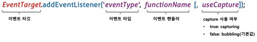

# 이벤트
- 이벤트가 발생했을 때 호출될 함수를 이벤트 핸들러 라고한다.
- 이벤트가 발생했을 때 브라우저에게 이벤트 핸들러의 호출을 위임하는 것을 이벤트 핸들러 등록이라 한다.


## 마우스 이벤트
|이벤트 타입|이벤트 발생 시점|
|--|--|
|click|마우스 버튼을 클릭했을 때|
|dbclick|마우스 버튼을 더블클릭했을 때|
|mousedown|마우스 버튼을 눌렀을 때|
|mouseup|누르고 있던 마우스 버튼을 놓았을 때|
|mousemove|마우스 커서를 움직였을 때|
|mouseenter|마우스 커서를 HTML 요소 안으로 이동했을 때(버블링 되지 않는다.)|
|mouseover|마우스 커서를 HTML 요소 안으로 이동했을 때(버블링 된다)|
|mouseleave|마우스 커서를 HTML 요소 밖으로 이동했을 때(버블링 되지 않는다)|
|mouseout|마우스 커서를 HTML 요소 밖으로 이동했을 때(버블링 된다)|

## 키보드 이벤트
|이벤트 타입|이벤트 발생 시점|
|--|--|
|keydown|모든 키를 눌렀을 때 발생한다.ctl,alt,shift,delete,enter, 방향키와 문자, 특수문자|
|keypress|문자 키를 눌렀을 때 연속적으로 발생한다(폐지 됨)|
|keyup|누르고 있던 키를 놓았을 때 한번만 발생한다|


## 포커스 이벤트
|이벤트 타입|이벤트 발생 시점|
|--|--|
|focus|HTML 요소가 포커스를 받았을 때(버블링되지 않는다.|
|blur|HTML 요소가 포커스를 잃었을 때(버블링되지 않는다|
|focusin|HTML 요소가 포커스를 받았을 때(버블링된다.)|
|focusout|HTML 요소가 포커스를 잃었을 때(버블링된다.)|

## 폼 이벤트
|이벤트 타입|이벤트 발생 시점|
|--|--|
|submit|form 요소 내의 submit 버튼을 클릭했을 때|
|reset|form 요소 내의 reset 버튼을 클릭했을 때|

## 값 변경 이벤트
|이벤트 타입|이벤트 발생 시점|
|--|--|
|input|input 요소의 값이 입력되었을 때|
|change|input 요소의 값이 변경되었을 때|
|readystatechange|HTML 문서의 로드와 파싱 상태를 나타내는 document.readyState 프로퍼티 값이 변경될 때|

## DOM 뮤테이션 이벤트
|이벤트 타입|이벤트 발생 시점|
|--|--|
|DOMContentLoaded|HTML 문서의 로드와 파싱이 완료되어 DOM 생성이 완료 되었을 때|

## 뷰 이벤트
|이벤트 타입|이벤트 발생 시점|
|--|--|
|resize|브라우저 윈도우의 크기를 리사이즈할 때 연속적으로 발생한다|
|scroll|웹페이지 또는 HTML 요소를 스크롤할 때 연속적으로 발생한다|


# 이벤트 핸들러 등록
- 이벤트 핸들러는 이벤트가 발생했을 때 브라우저에 호출을 위임한 함수다.

## 이벤트 핸들러 어트리뷰트 방식
- html태그에 이벤트 종류와 함수 호출문을 할당하면 이벤트 핸들러가 등록된다.
```javascript
// 어트리뷰트 방식
<button onclick = "sayHi('lee')"> Click me </buttom>
<script>
  function sayHi(name) {
    console.log(`hi ${name}`)
  }
</script>
```
- 주의할 점은 이벤트 핸들로 어트리뷰트 값으로 함수 참조가 아닌 함수 호출문 등의 문을 할당하는 것이다.
- 문을 할당하기 때문에 console.log('hi')처럼 문을 직접적으로 할당 할수 있으나 HTML과 Javascript는 개별적으로 관리하는게 용이 하므로 어트리뷰트 방식은 사용하지 않는 것이 좋다.

## 이벤트 핸들러 프로퍼티 방식
- window 객체와 Document, HTMLElement 타입의 DOM 노드 객체는 이벤트에 대응하는 이벤트 핸들러 프로퍼티를 가지고 있다.
- 이벤트 핸들러 프로퍼티에 함수를 바인딩하면 이벤트 핸들러가 등록된다.

```html
<!-- 프로퍼티 방식 -->
<button> Click me </button>
<script>
  $button = document.querySelector('button')
  $buntton.onclick = function () {
    console.log('button click')
  }
</script>
```

- 이벤트 핸들러를 등록하기 위해서는 이벤트를 발생시킬 객체인 이벤트 타깃과 이벤트 종류를 나타내는 문자열인 이벤트 타입 그리고 이벤트 핸들러를 지정할 필요가 있다.


- 어트리뷰트 방식과는 다르게 html과 javascript를 별도로 관리할 수 있지만 이벤트 핸들러 프로퍼티에 하나의 이벤트 핸들러만 바인딩할 수 있다는 단점이 있다.

## addEventListener 메서드 방식



- 첫 번째 매개변수에 이벤트 타입에 on 접두사를 붙이지 않고 
- 두 번째 매개변수에 이벤트 핸들러를 전달한다.
- 마지막 매개변수에는 이벤트를 캐치할 이벤트 전파 단계를 지정한다. 생략하거나 false를 지정하면 버블링 단게에서 이벤트를 캐치하고, true를 지정하면 캡처링 단계에서 이벤트를 캐치한다.

```html
<!-- addEventListener 방식 -->
<button> Click me </button>
<script>
  $button = document.querySelector('button')
  $buntton.addEventListener('click', function(){
    console.log('[1]button click')
  });
  $buntton.addEventListener('click', function(){
    console.log('[2]button click')
  });
</script>
```
- addEventListener 메서드만 하나 이상의 이벤트 핸들러를 등록할 수 있다. 이때 이벤트 핸들러는 등록된 순서대로 호출한다.
- 단, 참조가 동일한 이벤트 핸들러를 중복 등록하면 하나의 핸들러만 등록된다.


# 이벤트 핸들러 제거 
- addEventListener 메서드를 등록한 이벤트 핸들러를 제거하려면 Event.Target.prototype.removeEventListener 메서드를 사용한다. 
- removeEventListener과 addEventListener 인수가 일치해야지 제거된다.

```html
<button> Click me </button>
<script>
  const $button = document.querySelector('button');
  const handleClick = () => console.log('[1]button click');
  $button.addEventListener('click', handleClick)

  $button.removeEventListener('click', handleClick, true) // 실패
  $button.removeEventListener('click', handleClick) // 성공
</script>
```

- 무명 함수를 이벤트로 등록한 경우 제거할 수 없다. 이벤트 핸들러를 제거하려면 이벤트 핸들러의 참조를 변수나 자료구조에 저장하고 있어야 한다.

- 단 기명 이벤트 핸들러 내부에서 removeEventListener 메서드를 호출하여 이벤트 핸들러를 제거하는 것은 가능하다. 기명 이벤트 핸들러는 단 한번만 호출된다.

```html
<button> Click me </button>
<script>
  $button = document.querySelector('button')
  $buntton.addEventListener('click', function foo(){
    console.log('[1]button click')
    $button.removeEventListener('click', foo)
  });
</script>
```

# 이벤트 객체
- 이벤트가 발생하면 이벤트에 관련한 다양한 정보를 담고 있는 이벤트 객체가 동적으로 생성된다. 생성된 이벤트 객체는 이벤트 핸들러의 첫 번째 인수로 전달된다.

- 이벤트 핸들러 어트리뷰트의 경우 이벤트 핸들러의 첫 번째 매개변수 이름이 반드시 event이어야 한다. 다른 방식은 매개변수로 어떤 문자를 넣어도 첫번째 매개변수로 들어오기 때문에 상관없다.

## 이벤트 객체의 상속 구조
- 이벤트가 발생하면 이벤트 타입에 따라 타입의 이벤트 객체가 생성된다. 


- 이벤트가 발생하면 암묵적으로 생성되는 이벤트 객체도 생성자 함수에 의해 생성된다. 그리고 생성된 이벤트 객체는 생성자 함수와 더불어 생성되는 프로토타입으로 구성된 프로토타입 체인의 일원이 된다.

## 이벤트 객체의 공통 프로퍼티
- Event 인터페이스의 이벤트 관련 프로퍼티는 모든 이벤트 객체가 상속받는 공통 프로퍼티다.


## 마우스 정보 취득
- 마우스 관련 이벤트가 발생하면 생성되는 MouseEvent 타입의 이벤트 객체는 다음과 같은 고유의 프로퍼티를 갖는다.
  - 마우스 포인터의 좌표 정보를 나타내는 프로퍼티 : screenX/screenY, clientX/clientY, pageX/pageY, offsetX/offsetY
  - 버튼 정보를 나태내는 프로퍼티 : altKey, ctrlkey, shiftkey, button

```html
<!DOCTYPE html>
<html lang="en">
  <head>
    <style>
      .box {
        width: 100px;
        height: 100px;
        background-color: #fff700;
        border: 5px solid orange;
        cursor: pointer;
      }
    </style>
  </head>
  <body>
    <div class="box"></div>

    <script>
      // 드래그 대상 요소
      const $box = document.querySelector(".box");

      // 드래그 시작 시점의 마우스 포인터 위치
      const initialMousePos = { x: 0, y: 0 };

      // 오프셋 : 이동할 거리
      const offset = { x: 0, y: 0 };

      // mousemove 이벤트 핸들러
      const move = (e) => {
        // 오프셋 = 현재(드래그하고 있는 시점) 마우스 포인터 좌표 - 드래그 시작 시점의 마우스 포인터 좌표
        offset.x = e.clientX - initialMousePos.x;
        offset.y = e.clientY - initialMousePos.y;

        // translate3d는 GPU를 사용하므로 absolute의 top, left를 사용하는 것보다 빠르다.
        // top, left는 레이아웃에 영향을 준다
        $box.style.transform = `translate3d(${offset.x}px, ${offset.y}px, 0)`;
      };
      // mousedown 이벤트가 발생하면 드래그 시작 시점의 마우스 포인터 좌표를 지정한다.
      $box.addEventListener("mousedown", (e) => {

        // 이동 거리를 계산하기 위해 mousedown 이벤트 발생하면 드래그 시작 시점의
        // 마우스 포인터 좌표를 저장해 둔다.
        // 한 번 이상 드래그를 이동한 경우 move에서 translate3d으로 이동한 상태이므로 offset.x와 offset.y를 빼주어야 한다.
        initialMousePos.x = e.clientX - offset.x;
        initialMousePos.y = e.clientY - offset.y;

        // mousedown 이벤트가 발생한 상태에서 mousemove 이벤트가 발생하면 box 요소를 이동시킨다.
        document.addEventListener("mousemove", move);
      });

      // mouseup 이벤트가 발생하면 mousemove 이벤트를 제거해 이동을 멈춘다.
      document.addEventListener("mouseup", () => {
        document.removeEventListener("mousemove", move);
      });
    </script>
  </body>
</html>

```


## 키보드 정보 취득
- 키보드 관련 이벤트가 발생하면 keyboardEvent 타입의 이벤트 객체는 altKey, crtlkey, shiftkey, metakey, key, keycode 같은 고유의 프로퍼티를 갖는다.
- keyup 이벤트가 발생하면 생성되는 keyboardEvent 타입의 이벤트 객체는 입력한 키 값을 문자열로 반환하는 key 프로퍼티를 제공한다.
