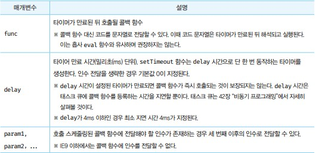

# 타이머
- 브라우저 환경과 Node.js 환경에서 모두 전역 객체의 메서드로서 타이머 함수를 제공한다. 즉 타이머 함수는 호스트 객체다.

- 자바스크립테 엔진은 싱그 스레드로 동작하기 때문에 타이머함수 setTimeout과 setInerval은 비동기 처리 방식으로 동작한다.


# 타이머 함수

## setTimeout / clearTimeout
- setTimeout 함수는 두 번째 인수로 전달받은 시간으로 단 한 번 동작하는 타이머를 생성한다. 이후 타이머가 만료되면 첫 번째 인수로 전달받은 콜백 함수가 호출된다.




```javascript
// 1초 후 타이머가 만료되면 콜백 함수가 호출된다.
setTimeout(()=> console.log('hi!'), 1000)

// 콜백 함수에 'Lee'가 인수로 전달된다.
setTimeout(name=> console.log('hi! ${name}'), 1000, 'Lee')

const timeId = setTimeout(()=> console.log('hi!'), 1000)
clearTimeout(timeId)
```

- clearTimeout 으로 setTimeout을 타이머를 취소할 수 있다.

## setInterval / clearInterval
- 타이머가 취소될 때 까지 콜백함수의 내용을 전달받은 시간으로 계속 반복한다.
- 취소는 clearInterval로 할 수 있다.

## 디바운스
- 디바운스는 짧은 시간 간격으로 이벤트가 연속해서 발생하면 이벤트 핸들러를 호출하지 않다가 일정 시간이 경과한 이후에 이벤트 핸들러가 한 번만 호출되도록 한다. 즉, 디바운스는 짧은 시간 간격으로 발생하는 이벤트를 그룹화해서 마지막에 한 번만 이벤트 핸들러가 호출되도록 한다.

- 디바운스 함수에 두 번째 인수로 전달한 시간보다 짧은 간격으로 이벤트가 발생하면 이전 타이머를 취소하고 새로운 타이머를 재설정한다.

## 스로틀
- 스로틀은 짧은 시간 간격으로 이벤트가 연속해서 발생하더라도 일정 시간 간격으로 이벤트 핸들러가 최대 한 번만 호출되도록 한다. 즉, 스로틀은 짧은 시간 간격으로 연속해서 발생하는 이벤트를 그룹화해서 일정 시간 단위로 이벤트 핸들러가 호출되도록 호출 주기를 만든다.

- 스로틀 함수가 반환한 함수는 스로틀 함수에 두 번째 인수로 전달한 시간이 경과하기 이전에 이벤트가 발생하면 아무것도 하지 않다가 delay 시간이 경과했을 때 이벤트가 발생하면 콜백 함수를 호출하고 새로운 타이머를 재설정한다. 