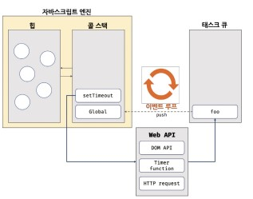

# 비동기
- 자바스크립트 엔진은 단 하나의 실행 컨텍스트 스택을 갖는다. 이는 함수를 실행할 수 있는 창구가 단 하나이며, 동시에 2개 이상의 함수를 동시에 실행할 수 없다는 것을 의미한다.
- 그렇기 때문에 한번에 하나의 태스크만 실행할 수 있는 싱글 스레드 방식으로 동작한다. 
- 싱글 스레드 방식은 한 번에 하나의 태스크만 실행할 수 있기 때문에 처리에 시간이 걸리는 태스크를 실행하는 경우 블로킹(작업 중단)이 발생한다.

- 동기 처리 : 현재 실행 중인 테스크가 종료할 때까지 다음에 실행될 태스크가 대기하는 방식이다. 동기 처리 방식은 태스크를 순서대로 하나씩 처리하므로 실행 순서가 보장된다는 장점이 있지만, 앞선 태스크가 종료할 때까지 이후 태스크들이 블로킹되는 단점이 있다.

- 비동기 처리 : 현재 실행 중인 태스크가 종료되지 않은 상태라 해도 다음 태스크를 곧바로 실행하는 방식을 비동기 처리라고 한다. 비동기 처리 방식은 현재 실행 중인 태스크가 종료되지 않은 상태라 해도 다음 태스크를 곧바로 실행하므로 블로킹이 발생하지 않는다는 장점이 있지만, 태스크의 실행 순서가 보장되지 않는 단점이 있다.

- 타임 함수인 setTimeout과 setInterval, HTTP 요청, 이벤트 핸들러는 비동기 처리 방식으로 동작한다.

## 이벤트 루프와 태스크 큐
- 이벤트 루프는 브라우저에 내장되어 있는 기능 중 하나다.

- 콜 스택 : 실행 컨텍스트 스택을 의미한다. 
- 힙 : 객체가 저장되는 메모리 공간이다. 콜 스택의 요소인 실행 컨텍스트는 힙에 저장된 객체를 참조한다.

- 비동기 처리에서 소스코드의 평가와 실행을 제외한 모든 처리는 자바스크립트 엔진을 구동하는 환경인 브라우저 또는 Node.js가 담당한다. 
- 예를 들어, 비동기 방식으로 동작하는 setTimeout의 콜백 함수의 평가와 실행은 자바스크립트 엔진이 담당하지만 호출 스케줄링을 위한 타이머 설정과 콜백 함수의 등록은 브라우저 또는 Node.js가 담당한다. 이를 위해 브라우저 환경은 태스크 큐와 이벤트 루프를 제공한다.

- 태스크 큐 : setTimeout이나 setInterval과 같은 비동기 함수의 콜백 함수 또는 이벤트 핸들러가 일시적으로 보관되는 영역이다. 

- 이벤트 루프 : 콜스택에 현재 실행 중인 실행 컨텍스트가 있는지, 그리고 태스크 큐에 대기 중인 함수(콜백 함수, 이벤트 핸들러등)가 있는지 반복해서 확인한다. 만약 콜 스택이 비어 있고 태스크 큐에 대기 중인 함수가 있다면 이벤트 루프는 순차적으로 태스크 큐에 대기 중인 함수를 콜 스택으로 이동시킨다.

- 자바스크립트는 싱글 스레드 방식으로 동작한다. 이때 싱글 스레드 방식으로 동작하는 것은 브라우저가 아니라 브라우저에 내장된 자바스크립트 엔진이라는 것에 주의하기 바란다. 만약 모든 자바스크립트 코드가 자바스크립트 엔진에서 싱글 스레드 방식으로 동작한다면 자바스크립트는 비동기로 동작할 수 없다. 즉, 자바스크립트 엔진은 싱글 스레드로 동작하지만 브라우저는 멀티 스레드로 동작한다.

