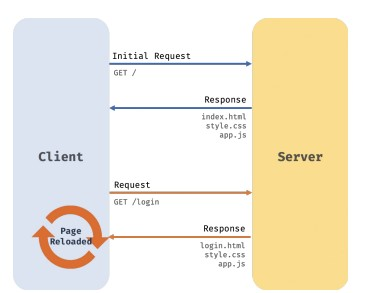
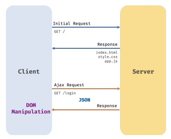
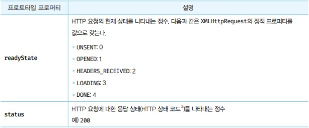
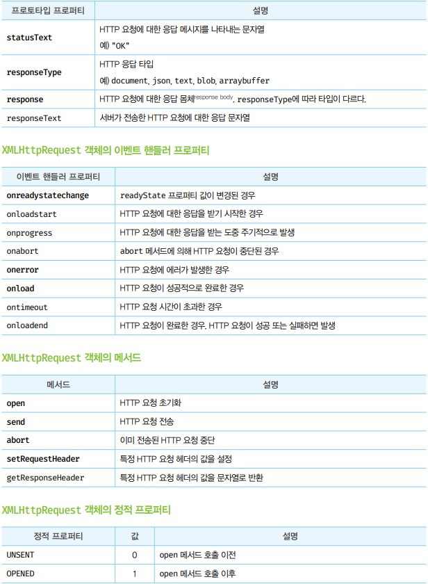

# Ajax
- Ajax : 자바스크립트를 사용하여 브라우저가 서버에게 비동기 방식으로 데이터를 요청하고, 서버가 응답한 데이터를 수신하여 웹페이지를 동적으로 갱신하는 프로그래밍 방식을 말한다.
- Ajax가 등장으로 서버로부터 웹 페이지의 변경에 필요한 데이터반 비동기 방식으로 전송받아 웹페이지를 변경할 필요가 없는 부분은 다시 렌더링하지 않고, 변경할 필요가 있는 부분만 렌더링하는 방식이 가능해진 것이다.




- 과거 방식




- Ajax 방식

- 과거방식에 비해 Ajax에 장점은
  1. 변경할 부분을 갱신하는 데 필요한 데이터만 서버로부터 전송받기 때문에 불필요한 데이터 통신이 발생하지 않는다.
  2. 변경할 필요가 없는 부분은 다시 렌더링하지 않는다. 따라서 화면이 순간적으로 깜빡이는 현상이 발생하지 않는다.
  3. 클라이언트 서버와의 통신이 비동기 방식으로 동작하기 때문에 서버에게 요청을 보낸 이후 블로킹이 발생하지 않는다.

## JSON
- JSON은 클라이언트와 서버 간의 HTTP 통신을 위한 텍스트 데이터 포맷이다.
- 자바스크립트에 종속되지 않고 대부분의 프로그래밍 언어에서 사용할 수 있다.

- JSON은 자바스크립트의 객체 리터럴과 유사하게 키와 값으로 구성된 순수한 텍스트다.
- JSON의 키는 반드시 큰따옴표로 묶어야 한다.

## JSON.stringify
- Json.stringify 메서드는 객체를 JSON 포맷의 문자열로 변환한다. 클라이언트가 객체를 전송하려면 객체를 문자열화해야 하는데 이를 `직렬화`라 한다.

```javascript
const obj = {
  name: "lee",
  age: 20,
  alive: true,
  hobby: ["traveling", "tennis"],
};

const json = JSON.stringify(obj);
console.log(json);
// {"name":"lee","age":20,"alive":true,"hobby":["traveling","tennis"]}
const test = JSON.stringify(obj, null, 2);
console.log(test);
// {
//   "name": "lee",
//   "age": 20,
//   "alive": true,
//   "hobby": [
//     "traveling",
//     "tennis"
//   ]
// }
```

## JSON.parse
- JSON.parse 메서드는 JSON 포맷의 문자열을 객체로 변환한다. 서버로부터 클라이언트에게 전송된 JSON 데이터는 문자열이다. 이 문자열을 객체로서 사용하려면 JSON 포맷의 문자열을 객체화해야 하는데 이를 역질렬화라 한다.

```javascript
const obj = {
  name: "lee",
  age: 20,
  alive: true,
  hobby: ["traveling", "tennis"],
};

const json = JSON.stringify(obj);

const parsed = JSON.parse(json);
console.log(typeof parsed, parsed);
// object { name: 'lee', age: 20, alive: true, hobby: [ 'traveling', 'tennis' ] }
```

# XMLHttpRequest
- 자바스크립트를 사용하여 HTTP 요청을 전송하려면 XMLHttpRequest 객체를 사용한다. Web API인 XMLHttpRequest 객체는 HTTP 요청 전송과 HTTP 응답 수신을 위한 다양한 메서드와 프로퍼티를 제공한다.

## XMLHttpRequest 객체 생성
- XMLHttpRequest 객체는 XMLHttpRequest 생성자 함수를 호출하여 생성한다. XMLHttpRequest 객체는 브라우저에서 제공하는 Web API이므로 브라우저 환경에서만 정상적으로 실행된다.

## XMLHttpRequest 객체의 프로퍼티와 메서드

- XMLHttpRequest 객체는 다양한 프로퍼티와 메서드를 제공한다. 



