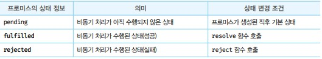

# Promise
- ES6에서는 비동기 처리를 위한 또 다른 패턴으로 프로미스를 도입했다. 프로미스는 전통적인 콜백 패턴이 가진 단점을 비동기 처리 시점을 명확하게 표현할 수 있다는 장점이 있다.
- 비동기 함수를 호출하면 함수 내부의 비동기로 동작하는 코드가 완료되지 않았다 해도 기다리지 않고 즉시 종료된다. 즉, 비동기 함수 내부의 비동기로 동작하는 코드는 비동기 함수가 종료된 이후에 완료된다. 따라서 비동기 함수 내부의 비동기로 동작하는 코드에서 처리 결과를 외부로 반환하거나 상위 스코프의 변수에 할당하면 기대한 대로 동작하지 않는다.

## 프로미스의 생성
- Promise 생성자 함수를 new 연산자와 함께 호출하면 프로미스를 생성한다.
- Promise 생성자 함수는 비동기 처리를 수행할 콜백 함수를 인수로 전달받는데 이 콜백 함수는 resolve와 reject 함수를 인수로 전달받는다.

```javascript
const promiseGet = url => {
  return new Promise((resolve, reject) => {
    const xhr = new XMLHttpRequest();
    xhr.open('GET', url);
    xhr.send()

    xhr.onload = () => {
      if(xhr.status === 200) {
        // 성공적으로 응답을 전달받으면 resolve 함수를 호출
        resolve(JSON.parse(xhr.response));
      } else {
        // 에러 처리를 위해 reject 함수를 호출한다.
        reject(new Error(xhr.status))
      }
    }
  })
}
promiseGet('https://jsonplaceholder.typicode.com/posts/1')
```
- 비동기 함수은 promiseGet은 함수 내부에서 프로미스를 생성하고 반환한다. 비동기 처리는 promis 생성자 함수가 인수로 전달받은 콜백 함수 내부에서 수행한다. 비동기 처리가 성공하면 비동기 처리 결과를 resolve 함수에 인수로 전달하면서 호출하고, 비동기 처리가 실패하면 에러를 reject 함수에 인수로 전달하면서 호출한다.



- 프로미스는 위와 같이 현재 비동기 처리가 어떻게 진행되고 있는지를 나타내는 상태 정보를 갖는다.

- 생성된 직후의 프로미스는 기본적으로 pending 상태다. 이후 비동기 처리가 수행되면 비동기 처리 결과에 따라 다음과 같이 프로미스의 상태가 변경된다.


## 프로미스의 후속 처리 메서드
- 프로미스의 비동기 처리 상태가 변화하면 이에 따른 후속 처리를 해야 한다.
- 예를 들어 프로미스가 fulfilled 상태가 되면 프로미스의 처리 결과를 가지고 무언가를 해야하고, 프로미스가 rejected 상태가 되면 프로미스의 처리 결과를 가지고 에러 처리를 해야 한다.
- 이를 위해 프로미스는 호축 메서드 then, catch, finally를 제공한다.
- 프로미스의 비동기 처리 상태가 변화하면 후속 처리 메서드에 인수로 전달한 콜백 함수가 선택적으로 호출된다. 

## Promise.prototype.then
- then 메서드는 두 개의 콜백 함수를 인수로 전달받는다. 
- 첫 번째 콜백 함수는 프로미스가 resolve 함수가 호출된 상태가 되면 호출된다. 이때 콜백 함수는 프로미스의 비동기 처리 결과를 인수로 전달 받는다.
- 두 번째 콜백 함수는 프로미스가 rejected 상태가 되면 호출된다. 이때 콜백 함수는 프로미스의 에러를 인수로 전달받는다.
- 즉 첫 번째 콜백 함수는 비동기 처리가 성공했을때 두 번째 콜백함수는 비동기 처리가 실패했을 때 호출되는 콜백 함수이다.


## Promise.prototype.catch
- catch 메서드는 한 개의 콜백 함수를 인수로 전달받는다. catch 메서드의 콜백 함수는 프로미스가 rejected 상태인 경우만 호출된다.

## Promise.prototype.finally
- finally 메서드는 한 개의 콜백 함수를 인수로 전달받는다. finally 메서드의 콜백 함수는 프로미스의 성공 또는 실패와 상관없이 무조건 한 번 호출된다. finally 메서드는 프로미스의 상태와 상관없이 공통적으로 수행해야 할 처리 내용이 있을 대 유용하다.


## 프로미스의 에러 처리
- 비동기 처리에서 발생한 에러는 프로미스의 후속 처리 메서드 then, catch를 사용해 처리할 수 있다.

```javascript
promiseGet(url).then(
  res => console.log(res),
  err => console.error(err)
)

promiseGet(url)
  .then(res => console.log(res))
  .catch(err => console.error(err))
)
```
- then 메서드의 두 번째 콜백 함수는 첫 번째 콜백 함수에서 발생한 에러를 캐치하지 못하고 코드가 복잡해져서 가독성이 좋지 않다.

- catch 메서드를 모든 then 메서드를 호출한 이후에 호출하면 비동기 처리에서 발생한 에러뿐만 아니라 then 메서드 내부에서 발생한 에러까지 모두 캐치할 수 있다.

- 따라서 then 메서드에 두 번째 콜백함수를 전달하는 것보다 catch 메서드를 사용하는 것이 가독성이 좋고 명확하다.

## 프로미스 체이닝
- 비동기 처리를 위한 콜백 패턴은 콜백 헬이 발생하는 문제가 있다.
- then, catch, finally 후속처리 메서드는 언제나 프로미스를 반환하므로 연속적으로 호출할 수 있다. 이를 프로미스 체이닝이라 한다.
- 프로미스는 프로미스 체이닝을 통해 비동기 처리 결과를 전달받아 후속 처리를 하므로 비동기 처리를 위한 콜백 패턴에서 발생하던 콜백 헬이 발생하지 않는다. 다만 프로미스도 콜백 패턴을 사용하므로 콜백 함수를 사용하지 않는 것은 아니다.
