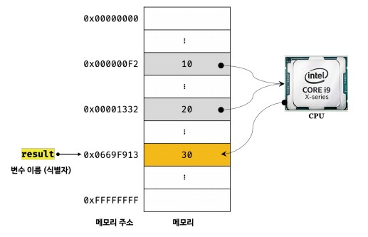
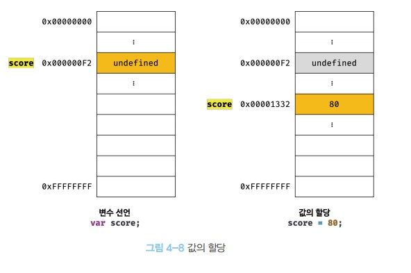

# 변수

## 변수란 무엇인가?

- 변수 : 하나의 값을 저장하기 위해 확보환 메모리 공간 자체 또는 그 메모리 공간을 식별하기 위해 붙인 이름을 말한다.

- 변수가 메모리에 저장되는 과정

```javascript
var result = 10 + 20;
```

- 10 + 20을 변수를 지정하지 않는다면 연산은 가능하지만 그 값을 재활용 할 수가 없다.
- 그렇기 때문에 메모리 주소의 변수이름(식별자를)붙혀 그 값을 불러올 수 있기 때문에 변수를 사용한다.



- 메모리 공간에 저장된 값을 식별할 수 있는 고유한 이름을 변수 이름(변수명)이라고 한다.
- 그 변수이름(변수명)에 저장된 값을 변수 값이라고 한다.

- Tip : 변수 이름은 변수에 저장된 값의 의미를 파악할 수 있도록 지어야 가독성이 높은 코드가 된다.

## 식별자

- 식별자 : 어떤 값을 구별해서 식별할 수 있는 고유한 이름을 말한다.

- 식별자가 없으면 메모리주소 0x053123처럼 메모리 주소로 직접 접근해야 하지만 식별자를 사용하면 주소의 내용없이 메모리 주소에 접근할 수 있다. 그래서 식별자를 변수 이름이라고도 한다.

- 식별자라는 용어는 변수 이름에만 한정해서 사용하지 않는다. 변수, 함수, 클래스 등의 이름은 모두 식별자가 된다.

## 변수 선언

- 변수 선언 : 값을 저장하기 위한 메모리 공간을 학보 하고 변수 이름과 확보된 메모리 공간의 주소를 연결해서 값을 저장할 수 있게 준비하는 것이다.

## var 메모리 저장 과정

- javascript는 변수를 선언하기전 var, let, const 키워드를 사용한다. let, const의 내용은 다른장에 나오므로 var 저장 과정만 적어 놓겠다.
- 변수 선언은 2단계에 거쳐 수행한다
  - 선언 단계 : 변수 이름을 등록해서 자바스크립트 엔진에 변수의 존재를 알린다.
  - 초기화 단계 : 값을 저장하기 위한 메모리 공간을 확보하고 암묵적으로 undefined를 할당해 초기화 한다.

```javascript
var example = 10;
```

- 위 코드를 예를 들어 설명하겠다.
- var라는 키워드를 만나면 example은 런타임 이전에 undefined를 가지고 있는다
- 그 후 기존에 있던 메모리에 undefined에 10을 덮어 씌우는 개념이 아닌 새로운 주소로 식별자를 옮기고 10이라는 메모리에 값을 생성한다.
- 이런 개념들 때문에 var라는 키워드는 호이스팅이 발생하는데

```javascript
console.log(a);
var a = 10;
```

- 위 코드는 다른 언어라면 변수를 선언하기전에 호출했기 때문에 오류를 발생해야하는데 자바스크립트는 런타임 이전에 undefined를 할당하기 때문에 undefined를 반환해 오류가 나지 않는다.
- 하지만 메모리주소에 값을 변경하는게 아니라 새로운 메모리 주소에 식별자를 옮긴 후 값을 생성하면 기존에 있떤 undefined는 사용하지 않느 값이 된다. 사용하지 않는 값인데 메모리 주소를 차지하기 때문에 메모리 누수가 발생하느 것이다.
- 그렇기 때문에 가바지 콜렉터라는 기능이 있는 것이다.
- 가비지 콜렉터는 메모리 공간을 주기적으로 검사하여 더 이상 어떤 식별자도 참조하지 않는 메모리 공간의 값을 해제시킨다.



## 매니지드 언어

- 프로그래밍 언어는 메모리 관리 방식에 따라 언매니지드 언어와 매니지드 언어로 분류할 수 있다.
- C 언어 같은 언매니지드 언어는 개발자가 명시적으로 메모리를 할당하고 해제할 수 있는 메모리 제어 기능을 제공해 개발자가 메모리 제어를 직접 주도 할 수 있다.
- 자바스크립트 같은 매니지드 언어는 메모리의 할당 및 해제를 위한 메모리 관리 기능을 언어 차원에서 담당해 개발자가 직접적인 메모리 제어를 허용하지 않는다.

## 네이밍 규칙

- 대부분 암묵적으로 자바스크립트에서는 변수나 함수의 이름에는 카멜케이스를 지정하고
- 생성자 함수, 클래스의 이름에는 파스칼 케이스를 사용한다.
- 카멜케이스 : firstName
- 파스칼 케이스 : FirstName
- 이제 까지 나는 스네이크 케이스를 주로 사용했는데 바꿔보도록 노력해야겠다.

## 추가 내용

- 메모리 셀에 저장 단위가 1바이트(8비트)인데 왜 8비트가 되었을까?
  - 메모리에 데이터를 저장하기 위해 특수문자를 포함한 모든 문자를 2진수로 표현한 ASCII코드가 2 ^ 7 승으로 128개이기 때문에 7비트 영역을 차지하고 데이터 전송중 오류가 발생했는지 검사하는 비트인 패리티 비트가 1비트를 차지해 8비트가 되었다고 한다.
