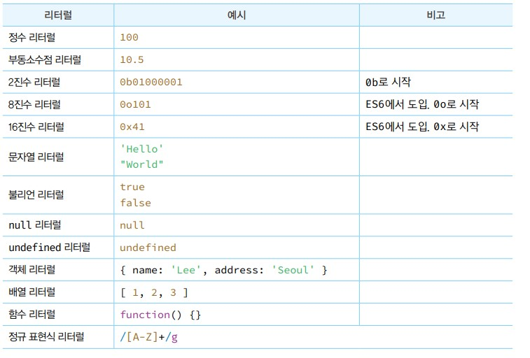
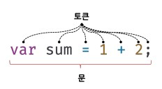

# 표현식과 문

## 리터럴

- 리터럴은 사람이 이해할 수 있는 문자 또는 약속된 기호를 사용해 값을 생성하는 표기법을 말한다.



- 위 표 처럼 약속된 양식을 지켜 입력하면 해당 값들이 어떤 데이터 형식의 값인지 반환하는 것이다.

## 표현식

- 표현식은 값으로 평가될 수 있는 문이다. 즉, 표현식이 평가되면 새로운 값을 생성하거나 기존 값을 참조한다.

```javascript
var score = 100;
```

- 위 코드의 100은 리터럴이다. 리터럴 100은 자바스크립트 엔진에 의해 평가되어 값을 생성하므로 리터럴은 그 자체로 표현식이다.

```javascript
var score = 50 + 50;
score;
```

- 위 코드의 50 + 50은 리터럴과 연산자로 이루어져 있지만 100을 생성하기 때문에 표현식이다.
- 아래의 score도 표현식이된다. score가 담고있는 값이 100이기 때문이다.
- 즉 표현식은 리터럴, 식별자, 연산자, 함수 호출 등의 조합으로 이루어질 수 있는데 값으로 평가될 수 있는 문은 모두 표현식이 되는 것이다.

## 문

- 문은 프로그램을 구성하는 기본 단위이자 최소 실행 단위다. 문의 집합으로 이루어진 것이 프로그램이며, 문을 작성하고 순서에 맞게 나열하는 것이 프로그래밍이다.
- 문은 토큰으로 구성된다. 토큰이란 문법적인 의미를 가지며, 문법적으로 더 이상 나눌 수 없는 코드의 기본 요소를 의미한다.
- 결국 `;`을 작성하는 단위는 하나의 문이 완성되었을 때 작성되는 것이다.



- 문을 명령문이라고도 부른다. 즉 문은 컴퓨터에 내리는 명령이다. 문이 실행되면 명령이 실행되고 무슨 일인지가 일어나게 된다.

```javascript
// 변수 선언문
var x;

// 할당문
x = 5;

// 함수 선언문
function foo() {}

// 조건문
if(x > 1) {console.log(x)}

// 반복문
for(var i = 0; i < 2; i++>) { console.log(i)}
```

## 표현식인 문과 표현식이 아닌 문

- 표현식은 문의 일부일 수도 잇고 그 자체로 문이 될 수도 있다.

```javascript
// 변수 선언문은 값으로 평가될 수 없으므로 표현식이 아닌 문이다.
var x;

// 1 + 2 는 표현식이지만 문이 아닌것이다.
// x = 1 + 2는 표현식이면서 문이 된다.
x = 1 + 2;
```

- 결국 표현식인 문과 표현식이 아닌 문을 구별하느 가장 간단한 방법은 변수에 할당해 보는 것이다.
- 변수에 할당되면 표현식인 문이고 에러를 반환하면 표현식이아닌 문이 되는 것이다.

```javascript
// 표현식이 아닌 문
var foo = var x

var t
var x = t
// t는 var키워드 때문에 선언하면 undefined가 할당되므로 var x = t 는 표현식인 문이 된다.
```

- 결국 표현식인 문은 값처럼 사용할 수 있다.
