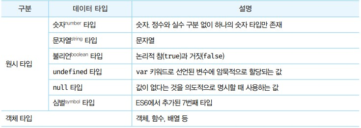

# 데이터 타입
- 데이터 타입은 값의 종류를 말한다. 자바스크립트의 모든 값은 데이터 타입을 갖는다.
- 자바스크립트(ES6)는 7개의 데이터 타입을 제공한다. 7개의 데이터 타입은 원시 타입과 객체 타입으로 분류할 수 있다.



- 각 타입은 리터럴에 의해 분류된다.
- 1과 '1'은 사람의 눈에는 같은 값이지만 저장되는 2진수도 다르며 타입도 다른 것이다.

## 숫자 타입
- 다른 언어의 경우 정수, 실수를 구분해서 int, long, float,double등과 같은 다양한 숫자타입을 제공하지만 자바스크립트는 숫자 타입만 존재한다.

- 자바스크립트의 숫자 타입은 모두 실수로 처리된다. 결국 정수로 표시되어도 사실 실수인것이다.

```javascript
console.log(1 === 1.0) // true
```
- 위 코드로 증명할 수 있다.

- 자바스크립트는 2진수, 8진수, 16진수 등을 표현하기 위한 데이터 타입을 제공하지 않기 때문에 2진수 리터럴, 8진수 리터럴을 사용해도 모두 10진수로 해석된다.

- 숫자 타입은 추가적으로 특별한 값도 표현 할 수 있다.
    - Infinity : 양의 무한대
    - -Infinity : 음의 무한대
    - NaN : 산술 연산 불가


## 문자열 타입
- 문자열 타입은 텍스트 데이터를 나타내는데 사용한다. 문자열은 0개 이상의 16비트 유니코드 문자의 집합으로 전 세계 대부분의 문자를 표현할 수 있다.
- 문자열 리터럴은 `'작은 따옴표'`, `"큰 따옴표"`, \``빽틱`\`이다.

## 템플릿 리터럴 
- 템플릿 리터럴은 ``으로 감싼다.
- ES6부터 템플릿 리터럴이라고 하는 새로운 문자열 표기법이 도입되었다.
- 일반 문자열 내에서는 줄바꿈이 허용되지 않는다.
```JAVASCRIPT
var str = 'hello
world'
// SyntexError 반환
```
- 그렇기 때문에 일반 문자열 내에서 줄바꿈 등의 공백을 표현하려면 \로 시작하는 이스케이프 시퀀스를 사용해야한다.

- 하지만 템플릿 리터럴에서는 줄바꿈이 허용되며, 모든 공백도 있는 그대로 적용된다.

- 또한 표현식도 삽입이 가능한데 원래 문자열은 +연산자로 문자열과 표현식을 이어주었지만
- 템플릿 리터럴에서는 `$`와 `{}`를 통해 해결할 수 있다.
```javascript
var name "songhyeon"

// 기본 문자열
console.log('hello my name is' + name)
// 템플릿 리터럴
console.log(`hello my name is ${name}`)
```

## 불리언 타입
- 불리언 타입의 값은 논리적 참, 거짓을 나타내는 true와 false가 있다.

```javascript
var foo = true
console.log(foo) // true

foo = false
console.log(foo) // false
```

## undefined 타입
- undefined 타입의 값은 undefined가 유일하다.
- 결국 변수를 선언만 하고 값을 초기화 하지 않았을때 자바스크립트 엔진이 자동으로 undefined 값을 할당한다.

## null 타입
- null 타입의 값은 null이 유일하다.
- null 값이란 변수의 값이 없다는 것을 개발자가 의도적으로 명시할 때 사용한다.
- 이는 이전에 할당되있던 값에 대한 참조를 명시적으로 제거하는 것을 의미한다. 특정값이나, undefined값에 해당된다.
- 또한 함수가 유효한 값을 반환할 수 없는 경우 명시적으로 null을 반환하기도 한다.

## Symbol 타입
- ES6에서 추가된 7번째 타입으로, 변경 불가능한 원시 타입의 값이다.
- 심볼 값은 다른 값과 중복되지 않는 유일무이한 값이다. 따라서 주로 이름이 충돌할 위험이 없는 객체의 유일한 프로퍼티 키를 만들기 위해 사용한다.
- 심볼 이외의 원시 값은 리터럴을 통해 생성하지만 심볼은 Symbol 함수를 호출해 생성한다.

## 객체 타입
- 자바스크립트는 객체 기반의 언어이며, 자바스크립트를 이루고 있는 거의 모든 것이 객체이다.
- 지바스크립트의 데이터 타입은 크게 원시 타입과 객체 타입으로 분류된다. 객체는 추후 챕터에 추가하겠습니다.

## 데이터 타입의 필요성
- 자바스크립트 엔진은 데이터 타입에 따라 정해진 크기의 메모리 공간을 확보하기 때문에 변수에 할당되는 값의 데이터 타입에 따라 확보해야 할 메모리 공간의 크기가 결정된다.
- 숫자 타입은 64비트 부동소수점 형식을 사용하기 때문에 메모리에서 8바이트(64비트)의 공간을 확보하게 된다.
- 식별자를 읽을 때 데이터 타입을 알아야 몇 바이트 단위로 읽어야 할지 정해지며, 숫자 타입은 8바이트 단위로 읽지 않을 경우 데이터가 훼손되므로 데이터 타입이 필요한 것이다.
- 그리고 메모리에 저장될 때 2진수로 저장되기 때문에 65를 2진수로 표현한 것과 A를 2진수로 표현한 것이 같기 때문에 데이터 타입이 필요하다
- 요약 하자자면 
    - 값을 저장할 때 확보해야 하는 메모리 공간의 크기를 결정하기 위해
    - 값을 참조할 때 한번에 읽어 들어야 할 메모리 공간의 크기를 결정하기 위해
    - 메모리에서 읽어 들인 2진수를 어떻게 해석할지 결정하기 위해

## 동적 타이핑
- 정적 타입 언어는 한번 선언된 변수 타입을 변경할 수 없으며, 처음 선언한 타이에 맞는 값만 할당할 수 있다.
- 자바스크립트는 변수를 선언할때 타입을 선언하지 않기 때문에 자유롭게 변경할 수 있다.
- 그렇기 때문에 자바스크립트는 변수의 값이 할당 될 때 타입이 결정될 뿐더라 변수의 타입은 언제나 변경될 수 있다.
- 이런 동적 타입이 편리하지만 단점이 존재한다.
- 개발자의 의도와는 다르게 타입이 변경될 때가 발생한다. 숫자 타입의 변수일 것이라고 예측했지만 문자열 타입의 변수가 될수 도 있다.
- 이런점을 조심해야한다.