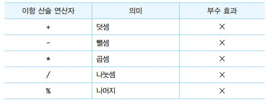
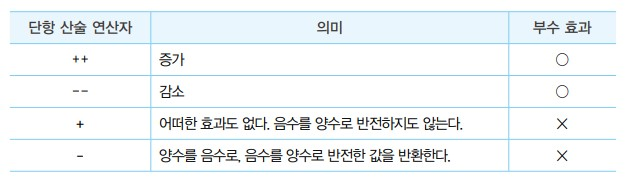
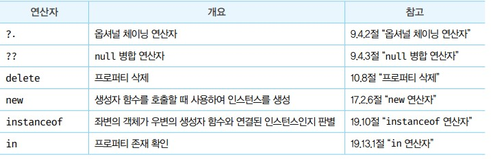
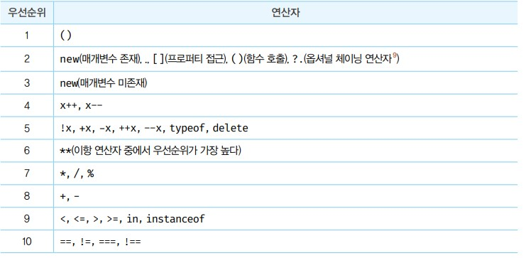

# 연산자
- 연산자는 하나 이상의 표현식을 대상으로 산술, 할당, 비교, 논리, 타입, 지수 연산 등을 수행해 하나의 값을 만든다.
- 이떄 연산의 대상을 피연산자라 하낟. 피연산자는 값으로 평가될 수 있는 표현식이어야햔다.

## 산술 연산자
- 산술 연산자는 피연산자를 대상으로 수학적 계산을 수행해 새로운 숫자 값을 만든다. 신슬 연산이 불가능한 경우 NaN을 반환한다.
- 산술 연산자는 피연산자의 개수에 따라 이항 산술 연산자와 단항 산술 연산자로 구분할 수 있다.

### 이항 산술 연산자
- 모든 이항 산술 연산자는 피연산자의 값을 변경하는 부수 효과가 없다. 즉, 어떤 산술 연산을 해도 피연산자의 값이 바뀌는 경우는 없고 언제나 새로운 값을 만들 뿐이다.



### 단항 산술 연산자
- 단항 산술 연산자는 1개의 피연산자를 산술 연산하여 숫자 값을 만든다.



- 주의점 증가/감소 연산자는 피연산자의 값을 변경하는 부수효과가 있다
- 증가/감소 연산자는 위치에 의미가 있다.

```javascript
var result
var x = 5

// 후위 증가 연산자 : 선할당 후 증가 
result = x++
console.log(result, x) // 5 6
// 위 처럼 x = x++한게 아닌데도 x의 값이 변경되는 사례를 부수효과라 함
// 전위 증가 연산자 : 선증가 후 할당
result = ++x
console.log(result, x) // 7 7

// 후위 감소 연산자 : 선할당 후 감소
result = x--
console.log(result, x) // 7 6

// 전위 감소 연산자 : 선감소 후 할당
result = --x
console.log(result, x) // 5 5
```
- `+`단항 연산자를 사용하면 피연산자를 숫자 타입으로 변환하여 반환한다.
- `-`단항 연산자를 사용하면 부호를 반전환 값과 데이터 타입이 숫자 타입으로 변환하여 반환한다.
- 숫자 타입으로 변경될 수 없는 데이터들은 NaN을 반환한다.

## 문자열 연결 연산자
- +연산자는 피연산자 중 하나 이상이 문자열인 경우 문자열 연결 연산자로 동작한다.
- 그 외의 경우는 산술 연산자로 동작한다

```JAVASCRIPT
'1' + 2 // '12'
1 + '2' // '12'

// true는 1로 타입 변환된다
1 + true // 2

// false는 0으로 타입 변환된다
1 + false // 1

// null은 0으로 타입 변환된다.
1 + null // 1

// undefined는 숫자로 타입 변환되지 않는다
1 + undefined // NaN
```

## 비교 연산자
- 동등 비교의 경우 `==`, `!=` 자바스크립트 엔진에 두개의 타입이 같은 타입으로 변한되어 데이터를 비교한다
- 0 == '' true를 반환하기 때문에 안티 패턴이므로 사용하지 않는 편이 좋다.
- 대신 일치 비교(===) 연산자를 사용한다.
- 일치 비교 연산자에서 주의할 점은 NaN === NaN false와 0 === -0 true이다.
- NaN은 자신과 일치하지 않는 유일한 값이다. 따라서 NaN인지 확인 하려면 isNaN을 사용해야 한다.
- 자바스크립트는 양의 0과 음의 0이 있는데 이들을 비교하면 true가 되기 때문에 Object.is(-0, +0)을 사용해야 false값을 반환할 수 있다.

## typeof 연산자
- typeof 연산자는 피연산자의 데이터 타입을 문자열로 반환한다.
- 하지만 null을 반환하는 경우는 없으며 함수의 경우 function을 반환하며 null값은 object를 반환한다.
- 이 현상은 자바스크립트에 버그이기 때문에 null 타입의 확인은 일치연산자를 사용해야한다.
```javascript
var foo = null
typeof foo === null // false
foo === null // true
```

- 또 하나의 주의 사항은 선언하지 않은 식별자를 typeof 연산자로 연산해 보면 ReferenceError가 아닌 undefined를 반환한다.

## 지수 연산자
- 좌항의 피연산자를 밑으로 우항의 피연산자를 지수로 거듭 제곱하여 숫자 값을 환한다.
```javascript
2 ** 2 // 4
2 ** 0 // 1
2 ** -2 // 0.25
(-5) ** 2
```
- 음수를 거듭제곱의 밑으로 사용해 계산하려면 괄호로 묶어야 한다.
- 지수 연산은 Math.pow메서드로도 구현 할 수 있다.
- 지수 연산자는 이항 연산자 중에서 우선순위가 가장 높다.

## 그 외의 연산자



- 그외의 연산자는 다른장에서 작성하겠습니다.

## 연산자 우선순위



- 여러 개의 연산자로 이뤄진 문이 실행될 때 연산자가 실행되는 순서이다.
