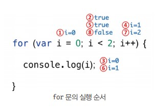

# 제어문
- 제어문은 조건에 따라 코드 블록을 실행(조건문)하거나 반복 실행(반복문)할 때 사용한다. 제어문을 사용하면 코드의 실행 흐름을 인위적으로 제어할 수 있기 때문에 정확히 제어해야한다.

## 블록문 
- 블록문은 0개 이상의 문을 중괄호로 묶은 것으로, 코드 블록 또는 블록이라도 부르며, 블록문을 하나의 실행 단위로 취급한다.
- 블록문은 언제나 문의 종료를 의미하는 자체 종결성을 갖기 때문에 블록문의 끝에는 세미클론을 붙이지 않는다.

```javascript
// 블록문
{
    var foo = 10
}

// 제어문
var x = 1
if (x < 10){
    x++
}

// 함수 선언문
function sum(a,b){
    return a + b
}
```

## for문
- for문은 조건식이 거짓으로 평가될 떄 까지 코드 블록을 반복 실행한다.
- for문에 동작과정은 아래와 같다



## do ... while문
- do...while문은 코드 블록을 먼저 실행하고 조건식을 평가한다. 따라서 코드 블록은 무조건 한번 이상 실행된다.
```javascript
var conut = 0
// count가 3보다 작을 때까지 코드 블록을 계속 반복한다
do{
    console.log(conut) // 0 1 2
    conut++
} while (conut < 3)

conut = 5
do{
    console.log(conut) // 5
    conut++
} while (conut < 3)
// 먼저 실행이 되고 종료조건을 판별하기 때문에 5는 출력된다.

```
- 제어문은 알고리즘 공부 할 떄 수도없이 했기 떄문에 몇 개념을 제외하고는 간략하게 넘어가겠습니다