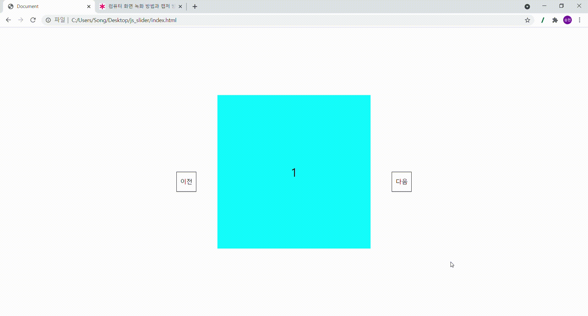

# vanillajs - slider


- vanilla.js로 slider를 구현 하기 위한 구조는
- 먼저 아이템 요소들을 일렬로 길게 세운다. css : flex로 구현
- 보여줄 px만큼에 div 태그를 만들어 overflow:hidden을 이용한다.
- 한칸 이동하기 위해서 클릭 버튼 한번당 translation : - 아이템 요소값을 준다.
  
```html
<!-- html 구조 -->
<div class="wrap">
    <div class = "slider_Wrap">
        <div class ="slider_List">
                <div class = "item" style="background-color: aqua;"><p>1</p></div>
                <div class = "item" style="background-color: yellowgreen;"><p>2</p></div>
                <div class = "item" style="background-color: tomato;"><p>3</p></div>
                <div class = "item" style="background-color: skyblue;"><p>4</p></div>
                <div class = "item" style="background-color: chocolate;"><p>5</p></div>
        </div>
        <div class="prev">이전</div>
        <div class="next">다음</div>
    </div>
    </div>
```
```css
/* css 구조 */
p{
  position: absolute;
  top: 50%;
  left: 50%;
  font-size: 30px;
  transform: translate(-50%,-50%);
}
.wrap{height: 100%;}
.slider_Wrap {     
  position: absolute;
  width: 400px;
  overflow: hidden;
  top: 50%;
  left: 50%;
  transform: translate(-50%, -50%);
}
.slider_List {  
  height: 400px;
  display: flex;
  flex-wrap: wrap;
  flex-direction: column;}
.item { width: 400px; height: 400px; position: relative}
.next,
.prev{
    cursor: pointer;
    position: absolute;
    top: 50%;
    border: 1px solid;
    width: 50px;
    height: 50px;
    line-height: 50px;
    text-align: center;
} 
.next {
right: 30%;    
}
.prev {
left: 30%;
}
```

```javascript
// js 구조
const slider_List = document.querySelector('.slider_List')
const items = document.querySelectorAll('.item')
const next = document.querySelector('.next')
const prev = document.querySelector('.prev')
const item_Width = 400;
const slide_speed = 300;
const item_len = items.length; 

const itemfirst = document.querySelector('.item:first-child')
const itemlast = document.querySelector('.item:last-child')
const firstNode = itemfirst.cloneNode(true);
const lastNode = itemlast.cloneNode(true);

let carindex = 0;

slider_List.appendChild(firstNode);
slider_List.insertBefore(lastNode, slider_List.firstElementChild);
slider_List.style.width = `${item_Width*(item_len+2)}px`
slider_List.style.transform = `translate(-${item_Width}px)`


next.addEventListener('click', function(){
    if(carindex <= item_len -1 ){
            slider_List.style.transition = slide_speed + "ms";
            slider_List.style.transform = `translate(-${item_Width*(carindex +2)}px)`
    }
    if (carindex  === item_len-1){
        setTimeout(function(){
        slider_List.style.transition = '0s' 
        slider_List.style.transform = `translate(-${item_Width}px,0)`
    }, 300)
        carindex  = -1   
    }
    carindex++
})


prev.addEventListener('click', function(){
    if(carindex >= 0){
        slider_List.style.transition = slide_speed + "ms";
        slider_List.style.transform = `translate(-${item_Width*(carindex)}px)`
    }
    if(carindex === 0){    
        setTimeout(function(){
        slider_List.style.transition = '0s' 
        slider_List.style.transform = `translate(-${item_Width * item_len}px)`
    }, 300)
    carindex = item_len
}
--carindex
})
```

```javascript
next.addEventListener('click', function(){
    if(carindex <= item_len -1 ){
            slider_List.style.transition = slide_speed + "ms";
            slider_List.style.transform = `translate(-${item_Width*(carindex +2)}px)`
    }
    if (carindex  === item_len-1){
        setTimeout(function(){
        slider_List.style.transition = '0s' 
        slider_List.style.transform = `translate(-${item_Width}px)`
    }, 300)
        carindex  = -1   
    }
    carindex ++
})
```
- 동작 로직을 설명하자면, 클릭 한번 할때마다 tanslate 값 -400씩 왼쪽으로 밀려가는 방식이다.
- 마지막 노드 값이 되면 tanslate 값이 -400 초기값으로 돌아오게 설정하였습니다.
- 클릭 한번에 자연스러움을 주기 위해 transition를 300ms로 주었지만 마지막엔 0s로 주었습니다.
- 하지만 그렇게 될 경우 자연스럽게 흘러가는 모션이 되지 않아 슬라이더 맨 앞 부분과 맨 마지막 부분에 clone node를 추가 하였습니다.
- 그래서 초기값을 -400으로 주었고, 5번에서 1번까지 진행을 하고 setimeout 300으로 300ms가 끝나는 시점과 동일하게 맨 첫번째 인덱스로 돌아가 자연스럽게 진행하도록 설정하였습니다.

# 완성

